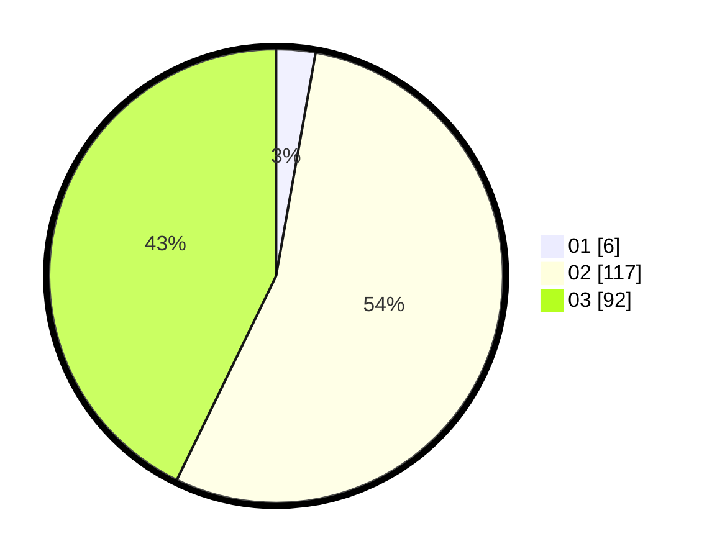

# Hasil

Hasil perolehan suara paslon dapat dilihat pada file paslon-01.txt, paslon-02.txt, dan paslon-03.txt.

Jika tidak ada, artinya data tersebut belum ada pada SIREKAP.

## Perolehan Suara

 * Paslon 01: **6**.
 * Paslon 02: **117**.
 * Paslon 03: **92**.

## Foto C Plano

https://sirekap-obj-formc.kpu.go.id/8f3f/pemilu/ppwp/31/73/06/10/05/3173061005227-20240214-215035--fd944f20-759d-417a-8a82-66c70454ca5a.jpg

https://sirekap-obj-formc.kpu.go.id/8f3f/pemilu/ppwp/31/73/06/10/05/3173061005227-20240214-141207--8a8e6236-02be-4aea-a4cf-1f3dc6f1b78c.jpg

https://sirekap-obj-formc.kpu.go.id/8f3f/pemilu/ppwp/31/73/06/10/05/3173061005227-20240215-085715--a27af2e2-aaf8-48c1-8147-bedc207c57fc.jpg
