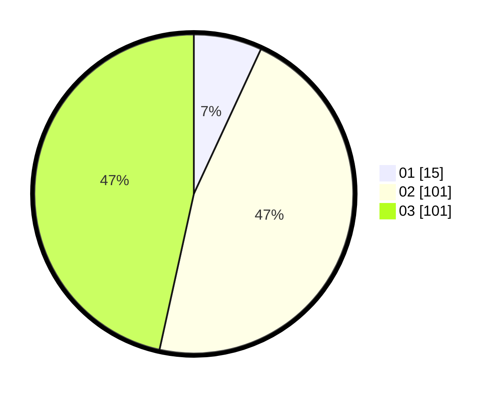

# Hasil

Hasil perolehan suara paslon dapat dilihat pada file paslon-01.txt, paslon-02.txt, dan paslon-03.txt.

Jika tidak ada, artinya data tersebut belum ada pada SIREKAP.

## Perolehan Suara

 * Paslon 01: **15**.
 * Paslon 02: **101**.
 * Paslon 03: **101**.

## Foto C Plano

https://sirekap-obj-formc.kpu.go.id/25ec/pemilu/ppwp/31/73/06/10/05/3173061005229-20240214-235950--8fe1292f-6378-42f1-91c3-1572d5e6a8fa.jpg

https://sirekap-obj-formc.kpu.go.id/25ec/pemilu/ppwp/31/73/06/10/05/3173061005229-20240218-220307--d74cf967-65bf-46ab-92c6-f9563c90fe7e.jpg

https://sirekap-obj-formc.kpu.go.id/25ec/pemilu/ppwp/31/73/06/10/05/3173061005229-20240214-223246--b5c6d644-b5b7-4491-981e-d1eadfaf3542.jpg
