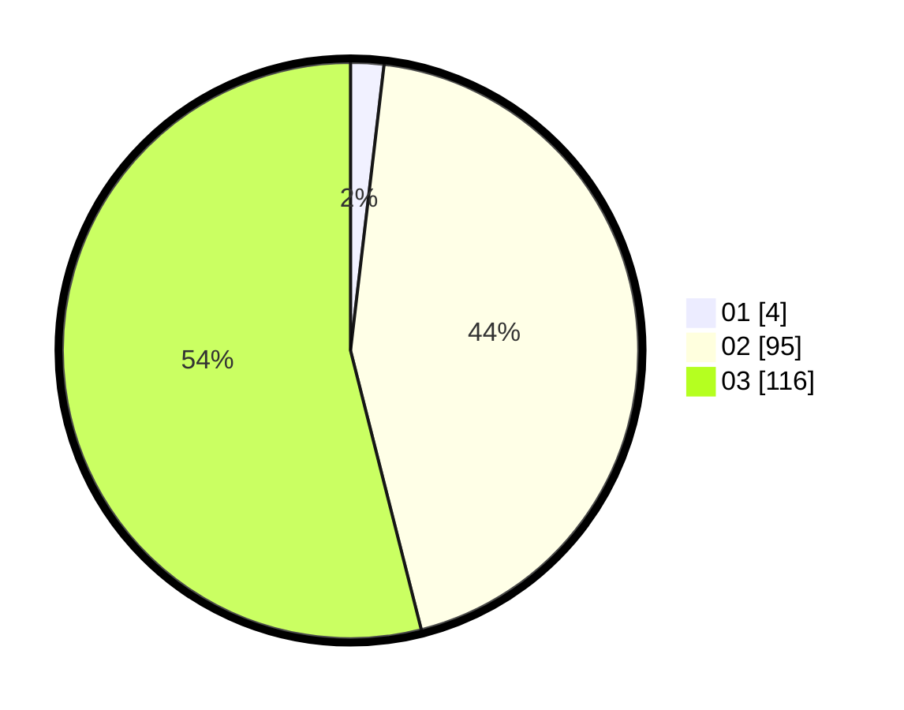

# Hasil

Hasil perolehan suara paslon dapat dilihat pada file paslon-01.txt, paslon-02.txt, dan paslon-03.txt.

Jika tidak ada, artinya data tersebut belum ada pada SIREKAP.

## Perolehan Suara

 * Paslon 01: **4**.
 * Paslon 02: **95**.
 * Paslon 03: **116**.

## Foto C Plano

https://sirekap-obj-formc.kpu.go.id/18d7/pemilu/ppwp/31/73/06/10/05/3173061005230-20240214-184524--0178c281-8fc5-486f-ad34-97ba5cf31c2e.jpg

https://sirekap-obj-formc.kpu.go.id/18d7/pemilu/ppwp/31/73/06/10/05/3173061005230-20240214-185938--8550215c-dcc7-42ce-be4e-70a76a924a08.jpg

https://sirekap-obj-formc.kpu.go.id/18d7/pemilu/ppwp/31/73/06/10/05/3173061005230-20240214-184642--9e9b1ff2-7342-434d-9c08-26206d10c7a9.jpg

## DATA PEMILIH TETAP

Jumlah pemilih dalam DPT: **273**.
 * L: **140**.
 * P: **133**.

## DATA PENGGUNA HAK PILIH

Jumlah pengguna hak pilih dalam DPT: **210**.
 * L: **112**.
 * P: **98**.

Jumlah pengguna hak pilih dalam DPTb: **2**.
 * L: **1**.
 * P: **1**.

Jumlah pengguna hak pilih dalam DPK: **3**.
 * L: **1**.
 * P: **2**.

Jumlah pengguna hak pilih: **215**.
 * L: **114**.
 * P: **101**.

## JUMLAH SUARA SAH DAN TIDAK SAH

JUMLAH SELURUH SUARA SAH: **215**.

JUMLAH SUARA TIDAK SAH: **0**.

JUMLAH SELURUH SUARA SAH DAN SUARA TIDAK SAH: **215**.
