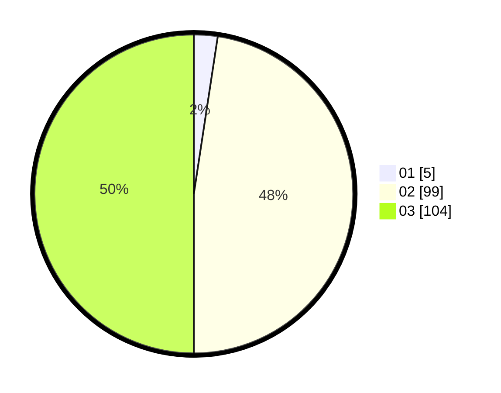

# Hasil

Hasil perolehan suara paslon dapat dilihat pada file paslon-01.txt, paslon-02.txt, dan paslon-03.txt.

Jika tidak ada, artinya data tersebut belum ada pada SIREKAP.

## Perolehan Suara

 * Paslon 01: **5**.
 * Paslon 02: **99**.
 * Paslon 03: **104**.

## Foto C Plano

https://sirekap-obj-formc.kpu.go.id/4fb4/pemilu/ppwp/31/73/06/10/05/3173061005231-20240214-190103--73f38aad-a57b-4f4b-8438-16bec67ab05d.jpg

https://sirekap-obj-formc.kpu.go.id/4fb4/pemilu/ppwp/31/73/06/10/05/3173061005231-20240214-193524--27ce38f0-8a88-4890-8047-34df5f643a28.jpg

https://sirekap-obj-formc.kpu.go.id/4fb4/pemilu/ppwp/31/73/06/10/05/3173061005231-20240214-190220--da01465b-4446-4eb2-900f-20b3d92e350d.jpg

## DATA PEMILIH TETAP

Jumlah pemilih dalam DPT: **254**.
 * L: **125**.
 * P: **129**.

## DATA PENGGUNA HAK PILIH

Jumlah pengguna hak pilih dalam DPT: **206**.
 * L: **102**.
 * P: **104**.

Jumlah pengguna hak pilih dalam DPTb: **3**.
 * L: **1**.
 * P: **2**.

Jumlah pengguna hak pilih dalam DPK: **0**.
 * L: **0**.
 * P: **0**.

Jumlah pengguna hak pilih: **209**.
 * L: **103**.
 * P: **106**.

## JUMLAH SUARA SAH DAN TIDAK SAH

JUMLAH SELURUH SUARA SAH: **208**.

JUMLAH SUARA TIDAK SAH: **1**.

JUMLAH SELURUH SUARA SAH DAN SUARA TIDAK SAH: **209**.
