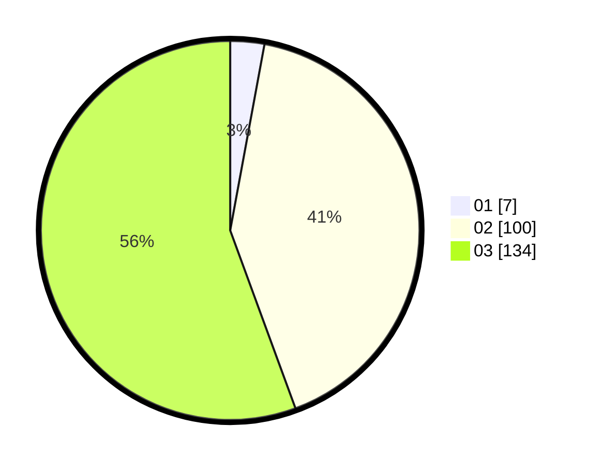

# Hasil

Hasil perolehan suara paslon dapat dilihat pada file paslon-01.txt, paslon-02.txt, dan paslon-03.txt.

Jika tidak ada, artinya data tersebut belum ada pada SIREKAP.

## Perolehan Suara

 * Paslon 01: **7**.
 * Paslon 02: **100**.
 * Paslon 03: **134**.

## Foto C Plano

https://sirekap-obj-formc.kpu.go.id/e945/pemilu/ppwp/31/73/06/10/05/3173061005239-20240214-214250--59343764-5cb0-4855-a29e-2a9e25013912.jpg

https://sirekap-obj-formc.kpu.go.id/e945/pemilu/ppwp/31/73/06/10/05/3173061005239-20240214-214340--a4936637-6782-426f-baa2-6d842a9ce9b7.jpg
