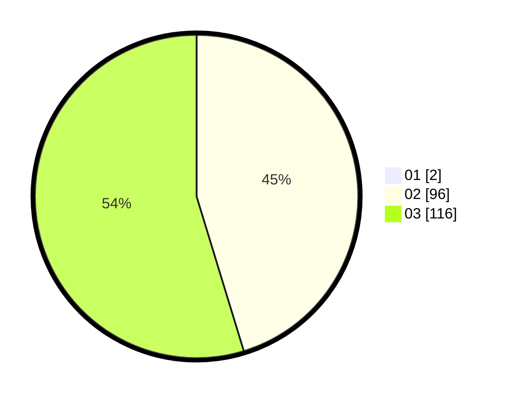

# Hasil

Hasil perolehan suara paslon dapat dilihat pada file paslon-01.txt, paslon-02.txt, dan paslon-03.txt.

Jika tidak ada, artinya data tersebut belum ada pada SIREKAP.

## Perolehan Suara

 * Paslon 01: **2**.
 * Paslon 02: **96**.
 * Paslon 03: **116**.

## Foto C Plano

https://sirekap-obj-formc.kpu.go.id/3e08/pemilu/ppwp/31/73/06/10/05/3173061005244-20240215-092612--f56e40b4-b072-4ae6-9cec-2daff0be0f76.jpg

https://sirekap-obj-formc.kpu.go.id/3e08/pemilu/ppwp/31/73/06/10/05/3173061005244-20240214-222159--9fa14704-55f3-42ac-9bf7-78fce7584764.jpg

https://sirekap-obj-formc.kpu.go.id/3e08/pemilu/ppwp/31/73/06/10/05/3173061005244-20240214-204646--880abaaa-3413-430b-aa1d-046b8e08b73d.jpg
