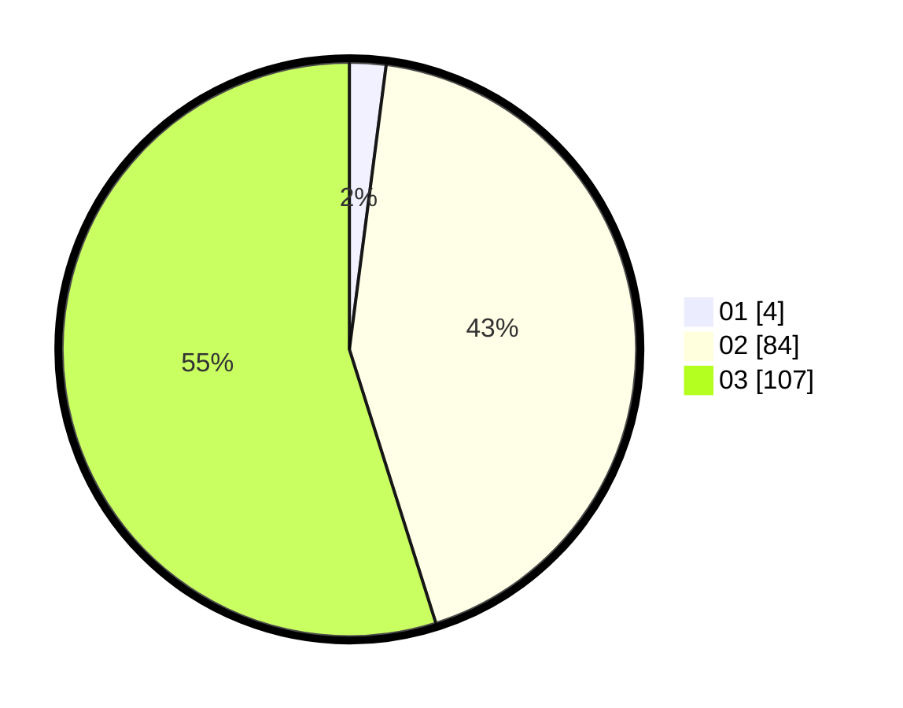

# Hasil

Hasil perolehan suara paslon dapat dilihat pada file paslon-01.txt, paslon-02.txt, dan paslon-03.txt.

Jika tidak ada, artinya data tersebut belum ada pada SIREKAP.

## Perolehan Suara

 * Paslon 01: **4**.
 * Paslon 02: **84**.
 * Paslon 03: **107**.

## Foto C Plano

https://sirekap-obj-formc.kpu.go.id/2764/pemilu/ppwp/31/73/06/10/05/3173061005245-20240214-221059--f2df1958-8e34-44e2-8493-9024de53e5bf.jpg

https://sirekap-obj-formc.kpu.go.id/2764/pemilu/ppwp/31/73/06/10/05/3173061005245-20240214-221153--e3d5ec2f-73a7-4b96-b375-9fa61d8927d1.jpg

https://sirekap-obj-formc.kpu.go.id/2764/pemilu/ppwp/31/73/06/10/05/3173061005245-20240214-221229--ce407cae-85aa-4b38-ac13-cca7193b7b98.jpg
