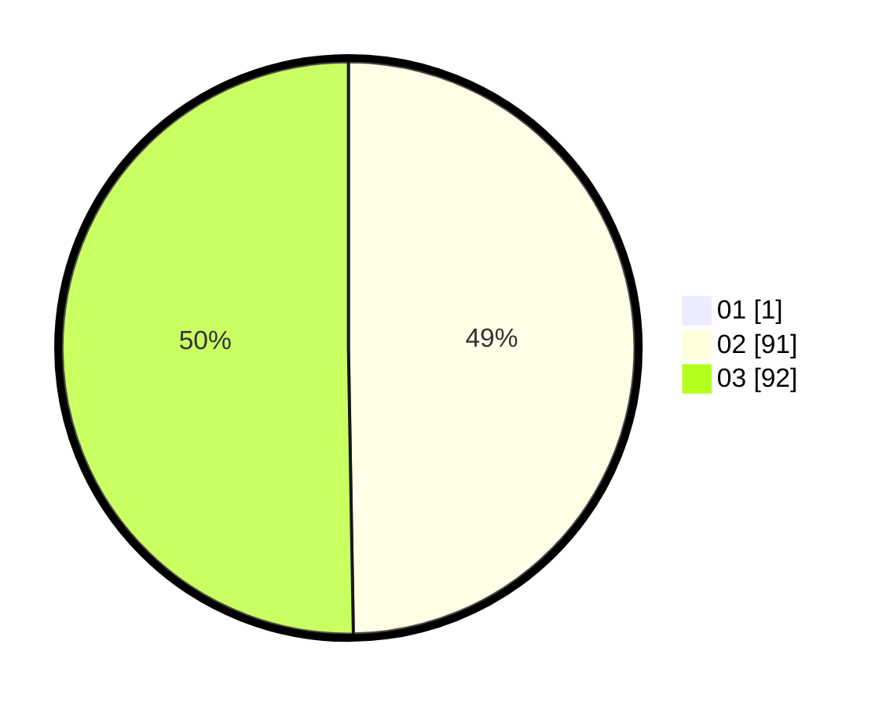

# Hasil

Hasil perolehan suara paslon dapat dilihat pada file paslon-01.txt, paslon-02.txt, dan paslon-03.txt.

Jika tidak ada, artinya data tersebut belum ada pada SIREKAP.

## Perolehan Suara

 * Paslon 01: **1**.
 * Paslon 02: **91**.
 * Paslon 03: **92**.

## Foto C Plano

https://sirekap-obj-formc.kpu.go.id/b4a2/pemilu/ppwp/31/73/06/10/05/3173061005247-20240214-230524--2f5aa1bb-762b-4dba-954f-e3ec8e162070.jpg

https://sirekap-obj-formc.kpu.go.id/b4a2/pemilu/ppwp/31/73/06/10/05/3173061005247-20240214-230534--c209f559-ee8f-44d9-9faf-069fdaab9994.jpg

https://sirekap-obj-formc.kpu.go.id/b4a2/pemilu/ppwp/31/73/06/10/05/3173061005247-20240214-230541--feb76af8-cbf8-41ac-aea9-1145a3b93b20.jpg
