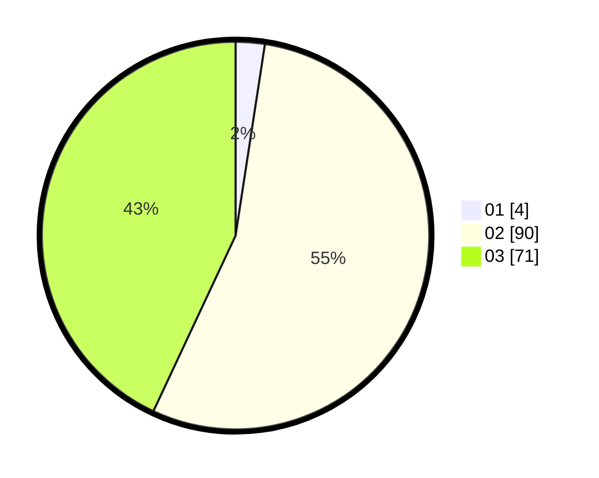

# Hasil

Hasil perolehan suara paslon dapat dilihat pada file paslon-01.txt, paslon-02.txt, dan paslon-03.txt.

Jika tidak ada, artinya data tersebut belum ada pada SIREKAP.

## Perolehan Suara

 * Paslon 01: **4**.
 * Paslon 02: **90**.
 * Paslon 03: **71**.

## Foto C Plano

https://sirekap-obj-formc.kpu.go.id/6687/pemilu/ppwp/31/73/06/10/05/3173061005248-20240214-202658--9e0e085f-2864-404d-9508-d53d668303fd.jpg

https://sirekap-obj-formc.kpu.go.id/6687/pemilu/ppwp/31/73/06/10/05/3173061005248-20240214-202708--015c79e7-9591-416e-8c7c-54543b6343b7.jpg

https://sirekap-obj-formc.kpu.go.id/6687/pemilu/ppwp/31/73/06/10/05/3173061005248-20240214-202714--c3477c13-6562-4375-bd8b-7b6382917ee7.jpg
