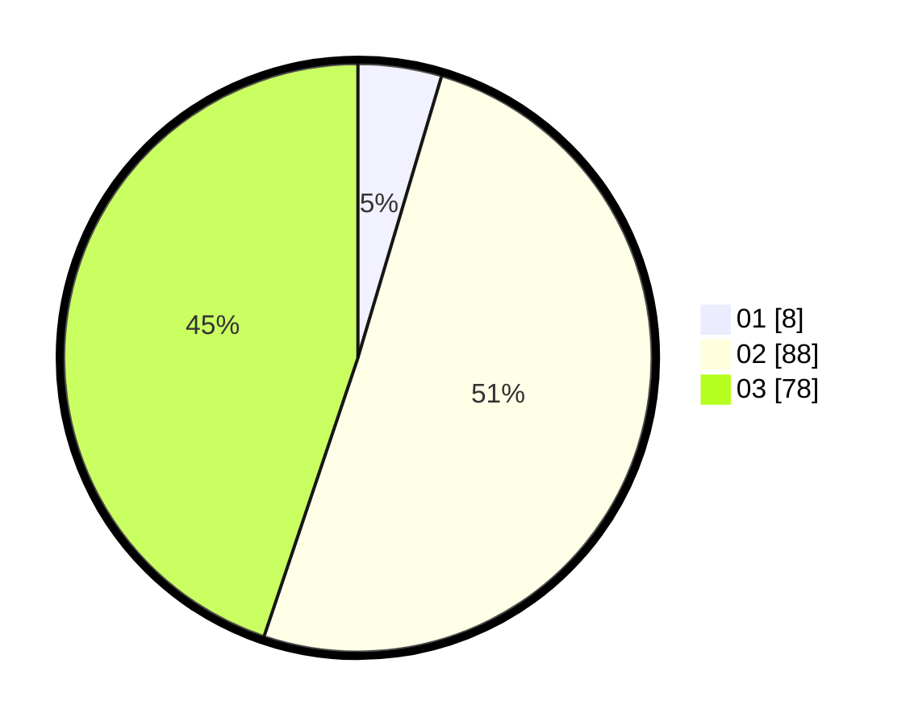

# Hasil

Hasil perolehan suara paslon dapat dilihat pada file paslon-01.txt, paslon-02.txt, dan paslon-03.txt.

Jika tidak ada, artinya data tersebut belum ada pada SIREKAP.

## Perolehan Suara

 * Paslon 01: **8**.
 * Paslon 02: **88**.
 * Paslon 03: **78**.

## Foto C Plano

https://sirekap-obj-formc.kpu.go.id/5373/pemilu/ppwp/31/73/06/10/05/3173061005249-20240214-230543--c8a3cea8-0dc1-4f3d-b448-225b756a7917.jpg

https://sirekap-obj-formc.kpu.go.id/5373/pemilu/ppwp/31/73/06/10/05/3173061005249-20240214-205634--854c9ddc-1223-4592-9484-1af641ffb4ff.jpg

https://sirekap-obj-formc.kpu.go.id/5373/pemilu/ppwp/31/73/06/10/05/3173061005249-20240214-215255--4939d91d-9e00-4cc2-843c-9f485c27a289.jpg
