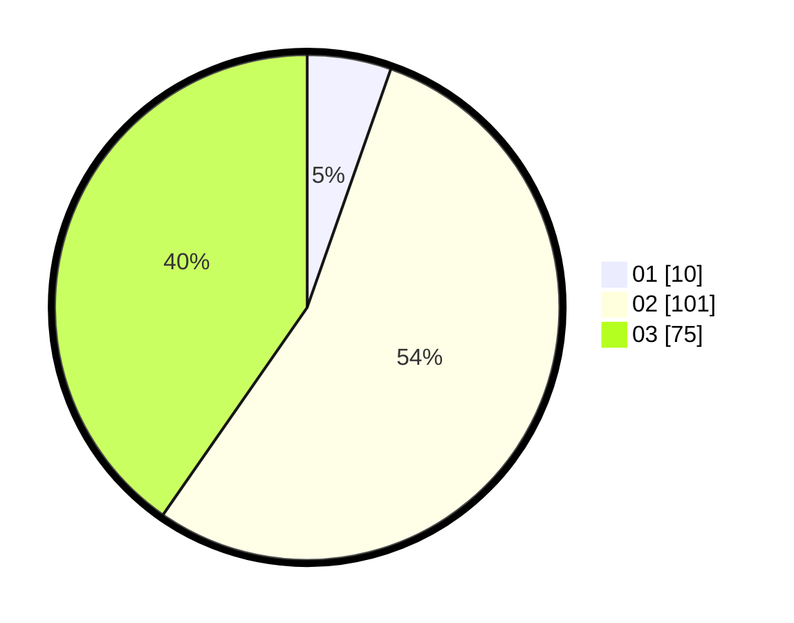

# Hasil

Hasil perolehan suara paslon dapat dilihat pada file paslon-01.txt, paslon-02.txt, dan paslon-03.txt.

Jika tidak ada, artinya data tersebut belum ada pada SIREKAP.

## Perolehan Suara

 * Paslon 01: **10**.
 * Paslon 02: **101**.
 * Paslon 03: **75**.

## Foto C Plano

https://sirekap-obj-formc.kpu.go.id/251e/pemilu/ppwp/31/73/06/10/05/3173061005251-20240214-215629--566c576f-fac8-41b3-9f2f-df25e1666804.jpg

https://sirekap-obj-formc.kpu.go.id/251e/pemilu/ppwp/31/73/06/10/05/3173061005251-20240214-215753--cc8ec72c-7b92-4a0b-bc43-08a0bbbf806d.jpg

https://sirekap-obj-formc.kpu.go.id/251e/pemilu/ppwp/31/73/06/10/05/3173061005251-20240214-205132--b365a0ea-d8e9-43ca-bd8f-7decaa660ae7.jpg
