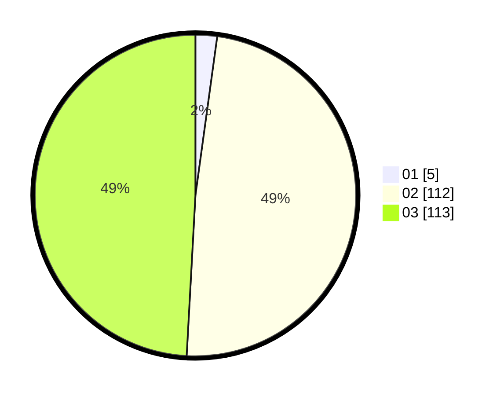

# Hasil

Hasil perolehan suara paslon dapat dilihat pada file paslon-01.txt, paslon-02.txt, dan paslon-03.txt.

Jika tidak ada, artinya data tersebut belum ada pada SIREKAP.

## Perolehan Suara

 * Paslon 01: **5**.
 * Paslon 02: **112**.
 * Paslon 03: **113**.

## Foto C Plano

https://sirekap-obj-formc.kpu.go.id/2ad9/pemilu/ppwp/31/73/06/10/05/3173061005255-20240215-223727--e08b7ec6-446e-4cda-a383-41b798450fc3.jpg

https://sirekap-obj-formc.kpu.go.id/2ad9/pemilu/ppwp/31/73/06/10/05/3173061005255-20240215-224433--6411ef65-e077-4a90-b194-0fb82cc0766d.jpg

https://sirekap-obj-formc.kpu.go.id/2ad9/pemilu/ppwp/31/73/06/10/05/3173061005255-20240215-223442--849a2230-6a1a-4f0f-ab1d-a7af48853184.jpg

## DATA PEMILIH TETAP

Jumlah pemilih dalam DPT: **289**.
 * L: **136**.
 * P: **153**.

## DATA PENGGUNA HAK PILIH

Jumlah pengguna hak pilih dalam DPT: **233**.
 * L: **107**.
 * P: **126**.

Jumlah pengguna hak pilih dalam DPTb: **3**.
 * L: **0**.
 * P: **3**.

Jumlah pengguna hak pilih dalam DPK: **0**.
 * L: **0**.
 * P: **0**.

Jumlah pengguna hak pilih: **236**.
 * L: **107**.
 * P: **129**.

## JUMLAH SUARA SAH DAN TIDAK SAH

JUMLAH SELURUH SUARA SAH: **230**.

JUMLAH SUARA TIDAK SAH: **6**.

JUMLAH SELURUH SUARA SAH DAN SUARA TIDAK SAH: **236**.
