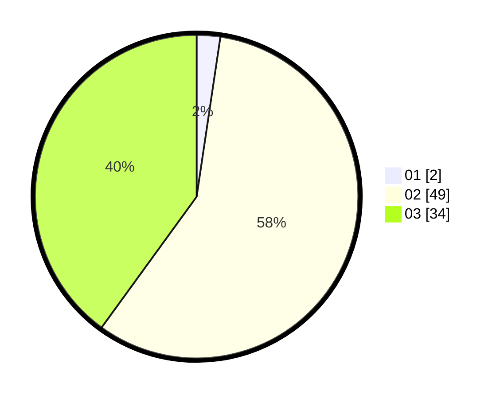

# Hasil

Hasil perolehan suara paslon dapat dilihat pada file paslon-01.txt, paslon-02.txt, dan paslon-03.txt.

Jika tidak ada, artinya data tersebut belum ada pada SIREKAP.

## Perolehan Suara

 * Paslon 01: **2**.
 * Paslon 02: **49**.
 * Paslon 03: **34**.

## Foto C Plano

https://sirekap-obj-formc.kpu.go.id/681c/pemilu/ppwp/31/73/06/10/05/3173061005256-20240215-210239--137cb74c-d130-4c10-b5a1-59bfaec79089.jpg

https://sirekap-obj-formc.kpu.go.id/681c/pemilu/ppwp/31/73/06/10/05/3173061005256-20240215-210242--7191b78d-3fc6-4173-8d80-4a51b1c501db.jpg

https://sirekap-obj-formc.kpu.go.id/681c/pemilu/ppwp/31/73/06/10/05/3173061005256-20240215-210240--c188bc75-faf1-476a-88fc-1228dd03ac7a.jpg

## DATA PEMILIH TETAP

Jumlah pemilih dalam DPT: **138**.
 * L: **69**.
 * P: **69**.

## DATA PENGGUNA HAK PILIH

Jumlah pengguna hak pilih dalam DPT: **86**.
 * L: **43**.
 * P: **43**.

Jumlah pengguna hak pilih dalam DPTb: **0**.
 * L: **0**.
 * P: **0**.

Jumlah pengguna hak pilih dalam DPK: **3**.
 * L: **1**.
 * P: **2**.

Jumlah pengguna hak pilih: **89**.
 * L: **44**.
 * P: **45**.

## JUMLAH SUARA SAH DAN TIDAK SAH

JUMLAH SELURUH SUARA SAH: **85**.

JUMLAH SUARA TIDAK SAH: **4**.

JUMLAH SELURUH SUARA SAH DAN SUARA TIDAK SAH: **89**.
