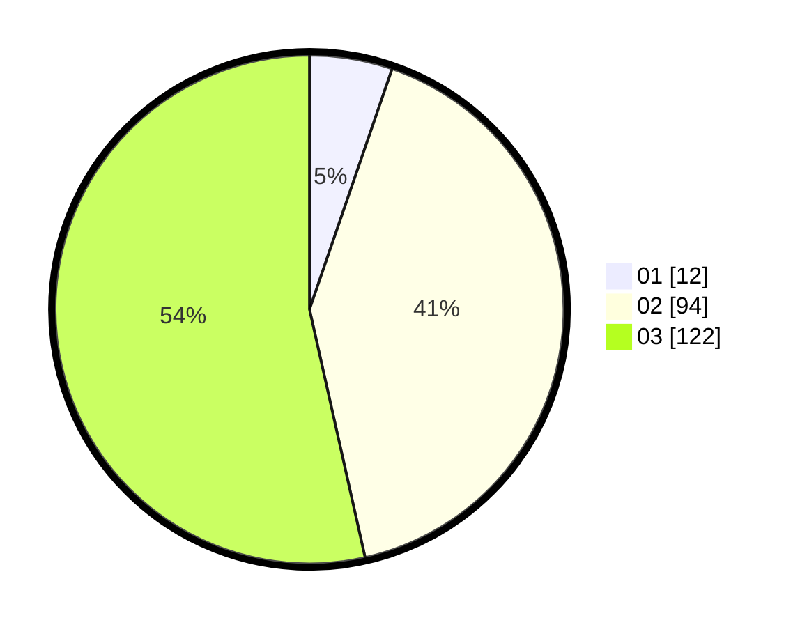

# Hasil

Hasil perolehan suara paslon dapat dilihat pada file paslon-01.txt, paslon-02.txt, dan paslon-03.txt.

Jika tidak ada, artinya data tersebut belum ada pada SIREKAP.

## Perolehan Suara

 * Paslon 01: **12**.
 * Paslon 02: **94**.
 * Paslon 03: **122**.

## Foto C Plano

https://sirekap-obj-formc.kpu.go.id/a551/pemilu/ppwp/31/73/06/10/05/3173061005260-20240214-222441--263fa781-8464-4a67-9714-666ee4da089f.jpg

https://sirekap-obj-formc.kpu.go.id/a551/pemilu/ppwp/31/73/06/10/05/3173061005260-20240214-222543--9a2ad3c2-d020-4c03-99f6-42298914bb7d.jpg

https://sirekap-obj-formc.kpu.go.id/a551/pemilu/ppwp/31/73/06/10/05/3173061005260-20240214-222636--11114090-e3cd-41ea-91e4-df82198db145.jpg
