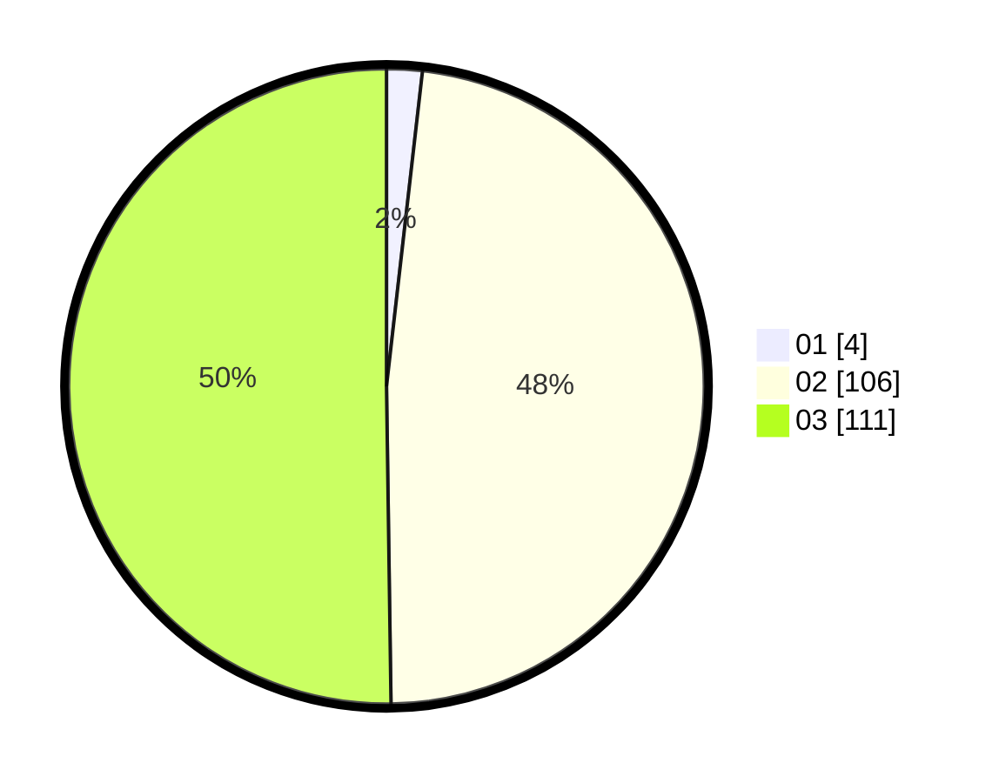

# Hasil

Hasil perolehan suara paslon dapat dilihat pada file paslon-01.txt, paslon-02.txt, dan paslon-03.txt.

Jika tidak ada, artinya data tersebut belum ada pada SIREKAP.

## Perolehan Suara

 * Paslon 01: **4**.
 * Paslon 02: **106**.
 * Paslon 03: **111**.

## Foto C Plano

https://sirekap-obj-formc.kpu.go.id/7ab8/pemilu/ppwp/31/73/06/10/05/3173061005262-20240214-192341--67c69d7a-a622-4fab-8b6b-b99a5e42d1af.jpg

https://sirekap-obj-formc.kpu.go.id/7ab8/pemilu/ppwp/31/73/06/10/05/3173061005262-20240214-192618--ef7a894f-013d-4c58-bbf6-42fe62f83931.jpg

https://sirekap-obj-formc.kpu.go.id/7ab8/pemilu/ppwp/31/73/06/10/05/3173061005262-20240214-192818--c42e450b-862c-4ceb-b2c6-003422417a54.jpg
