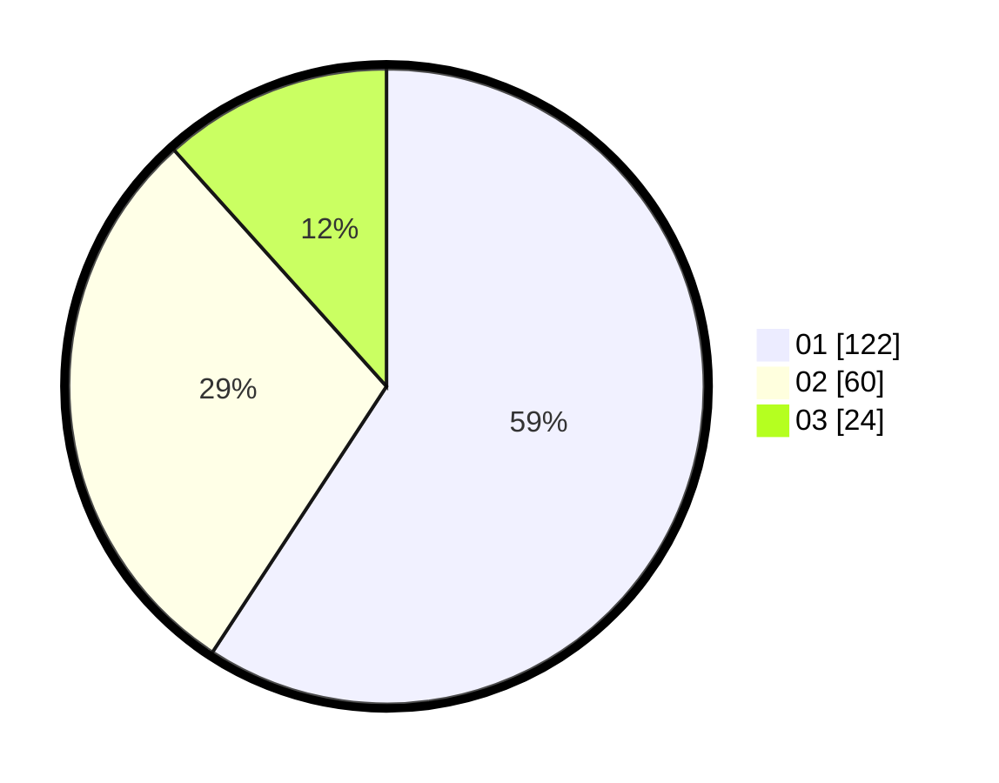

# Hasil

Hasil perolehan suara paslon dapat dilihat pada file paslon-01.txt, paslon-02.txt, dan paslon-03.txt.

Jika tidak ada, artinya data tersebut belum ada pada SIREKAP.

## Perolehan Suara

 * Paslon 01: **122**.
 * Paslon 02: **60**.
 * Paslon 03: **24**.

## Foto C Plano

https://sirekap-obj-formc.kpu.go.id/6e7e/pemilu/ppwp/31/73/07/10/01/3173071001001-20240214-155101--520ee169-b855-407d-bba4-bd6aa1ff391d.jpg

https://sirekap-obj-formc.kpu.go.id/6e7e/pemilu/ppwp/31/73/07/10/01/3173071001001-20240214-160125--98fee50b-115d-4d09-8e5a-991066895ff1.jpg

https://sirekap-obj-formc.kpu.go.id/6e7e/pemilu/ppwp/31/73/07/10/01/3173071001001-20240214-190615--c0d64b9c-9e33-4649-b9fb-68c74dc4f2b0.jpg

## DATA PEMILIH TETAP

Jumlah pemilih dalam DPT: **251**.
 * L: **130**.
 * P: **121**.

## DATA PENGGUNA HAK PILIH

Jumlah pengguna hak pilih dalam DPT: **198**.
 * L: **100**.
 * P: **98**.

Jumlah pengguna hak pilih dalam DPTb: **8**.
 * L: **4**.
 * P: **4**.

Jumlah pengguna hak pilih dalam DPK: **1**.
 * L: **0**.
 * P: **1**.

Jumlah pengguna hak pilih: **207**.
 * L: **104**.
 * P: **103**.

## JUMLAH SUARA SAH DAN TIDAK SAH

JUMLAH SELURUH SUARA SAH: **206**.

JUMLAH SUARA TIDAK SAH: **1**.

JUMLAH SELURUH SUARA SAH DAN SUARA TIDAK SAH: **207**.
