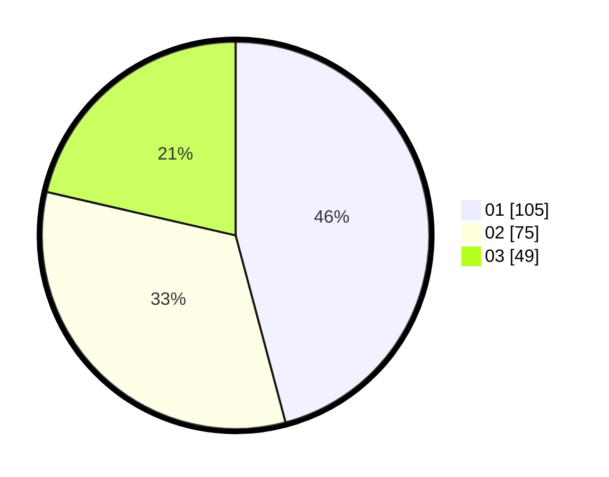

# Hasil

Hasil perolehan suara paslon dapat dilihat pada file paslon-01.txt, paslon-02.txt, dan paslon-03.txt.

Jika tidak ada, artinya data tersebut belum ada pada SIREKAP.

## Perolehan Suara

 * Paslon 01: **105**.
 * Paslon 02: **75**.
 * Paslon 03: **49**.

## Foto C Plano

https://sirekap-obj-formc.kpu.go.id/7ed4/pemilu/ppwp/31/73/07/10/01/3173071001008-20240214-220119--2a18f01b-5544-40cb-8e39-2036c4ca7125.jpg

https://sirekap-obj-formc.kpu.go.id/7ed4/pemilu/ppwp/31/73/07/10/01/3173071001008-20240214-215147--0e0b06df-1387-4b43-abc8-d43c7bc8daab.jpg

https://sirekap-obj-formc.kpu.go.id/7ed4/pemilu/ppwp/31/73/07/10/01/3173071001008-20240214-220015--b23ec3a8-11b7-4805-975b-1623433680e2.jpg
