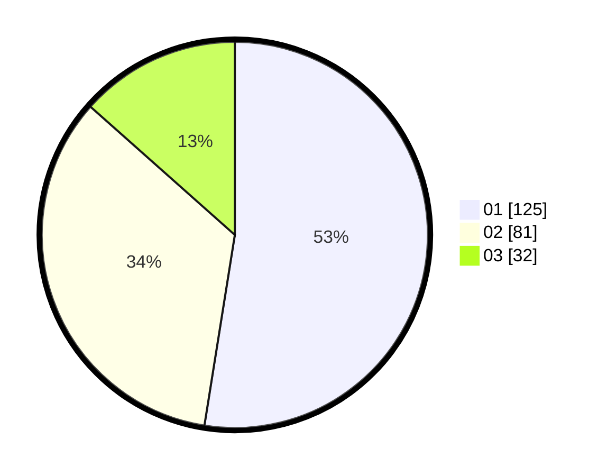

# Hasil

Hasil perolehan suara paslon dapat dilihat pada file paslon-01.txt, paslon-02.txt, dan paslon-03.txt.

Jika tidak ada, artinya data tersebut belum ada pada SIREKAP.

## Perolehan Suara

 * Paslon 01: **125**.
 * Paslon 02: **81**.
 * Paslon 03: **32**.

## Foto C Plano

https://sirekap-obj-formc.kpu.go.id/b31c/pemilu/ppwp/31/73/07/10/01/3173071001009-20240214-214914--a973905a-a3c1-4b3e-b10b-1fd07f852b84.jpg

https://sirekap-obj-formc.kpu.go.id/b31c/pemilu/ppwp/31/73/07/10/01/3173071001009-20240214-162225--86889fd3-802e-4439-bd39-e969a3c05457.jpg

https://sirekap-obj-formc.kpu.go.id/b31c/pemilu/ppwp/31/73/07/10/01/3173071001009-20240214-214926--bea2847f-0638-40e1-95f2-1530f9916ba1.jpg

## DATA PEMILIH TETAP

Jumlah pemilih dalam DPT: **284**.
 * L: **142**.
 * P: **142**.

## DATA PENGGUNA HAK PILIH

Jumlah pengguna hak pilih dalam DPT: **232**.
 * L: **111**.
 * P: **121**.

Jumlah pengguna hak pilih dalam DPTb: **6**.
 * L: **2**.
 * P: **4**.

Jumlah pengguna hak pilih dalam DPK: **3**.
 * L: **0**.
 * P: **3**.

Jumlah pengguna hak pilih: **241**.
 * L: **113**.
 * P: **128**.

## JUMLAH SUARA SAH DAN TIDAK SAH

JUMLAH SELURUH SUARA SAH: **238**.

JUMLAH SUARA TIDAK SAH: **3**.

JUMLAH SELURUH SUARA SAH DAN SUARA TIDAK SAH: **241**.
