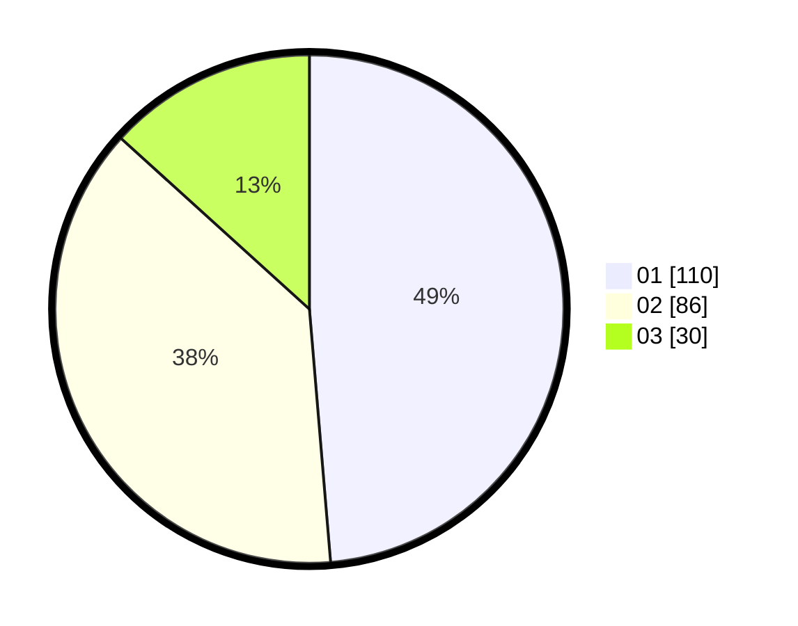

# Hasil

Hasil perolehan suara paslon dapat dilihat pada file paslon-01.txt, paslon-02.txt, dan paslon-03.txt.

Jika tidak ada, artinya data tersebut belum ada pada SIREKAP.

## Perolehan Suara

 * Paslon 01: **110**.
 * Paslon 02: **86**.
 * Paslon 03: **30**.

## Foto C Plano

https://sirekap-obj-formc.kpu.go.id/4047/pemilu/ppwp/31/73/07/10/01/3173071001014-20240214-210713--e946cf48-5c86-4108-927b-c4c05422431c.jpg

https://sirekap-obj-formc.kpu.go.id/4047/pemilu/ppwp/31/73/07/10/01/3173071001014-20240214-211035--9f1838b0-ee22-4e41-913d-0c63ee646596.jpg

https://sirekap-obj-formc.kpu.go.id/4047/pemilu/ppwp/31/73/07/10/01/3173071001014-20240214-211301--16caaf31-2616-49ff-9aac-4378b0a62a71.jpg

## DATA PEMILIH TETAP

Jumlah pemilih dalam DPT: **274**.
 * L: **134**.
 * P: **140**.

## DATA PENGGUNA HAK PILIH

Jumlah pengguna hak pilih dalam DPT: **222**.
 * L: **107**.
 * P: **115**.

Jumlah pengguna hak pilih dalam DPTb: **4**.
 * L: **3**.
 * P: **1**.

Jumlah pengguna hak pilih dalam DPK: **0**.
 * L: **0**.
 * P: **0**.

Jumlah pengguna hak pilih: **226**.
 * L: **110**.
 * P: **116**.

## JUMLAH SUARA SAH DAN TIDAK SAH

JUMLAH SELURUH SUARA SAH: **226**.

JUMLAH SUARA TIDAK SAH: **0**.

JUMLAH SELURUH SUARA SAH DAN SUARA TIDAK SAH: **226**.
