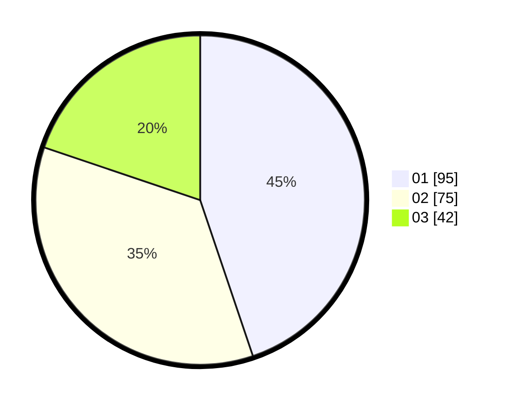

# Hasil

Hasil perolehan suara paslon dapat dilihat pada file paslon-01.txt, paslon-02.txt, dan paslon-03.txt.

Jika tidak ada, artinya data tersebut belum ada pada SIREKAP.

## Perolehan Suara

 * Paslon 01: **95**.
 * Paslon 02: **75**.
 * Paslon 03: **42**.

## Foto C Plano

https://sirekap-obj-formc.kpu.go.id/c265/pemilu/ppwp/31/73/07/10/01/3173071001015-20240214-231130--28a69980-c346-4470-a781-385b1764507d.jpg

https://sirekap-obj-formc.kpu.go.id/c265/pemilu/ppwp/31/73/07/10/01/3173071001015-20240214-231231--a62d114c-c38b-4ff7-8f2a-5d2a7c37d2f5.jpg

https://sirekap-obj-formc.kpu.go.id/c265/pemilu/ppwp/31/73/07/10/01/3173071001015-20240214-231343--2d50ec0a-237c-48b5-8ab5-39de217f9e18.jpg
