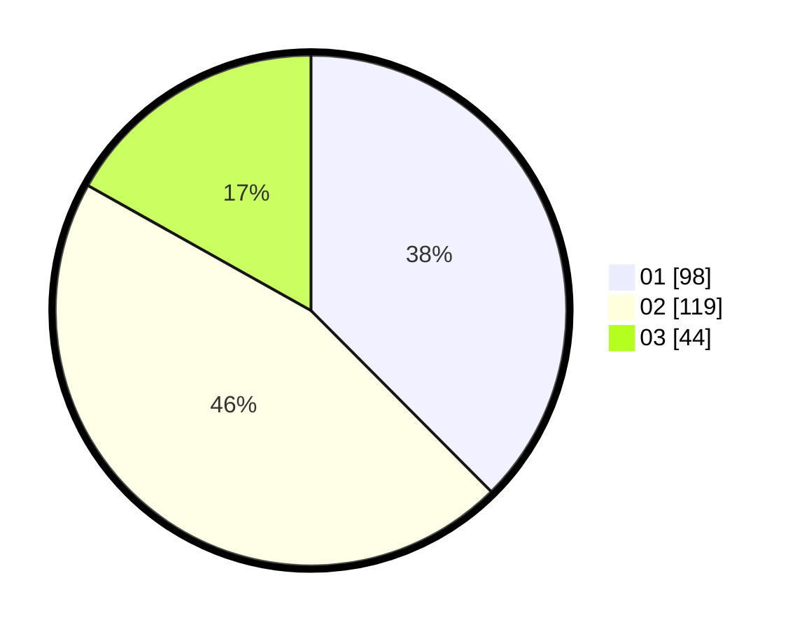

# Hasil

Hasil perolehan suara paslon dapat dilihat pada file paslon-01.txt, paslon-02.txt, dan paslon-03.txt.

Jika tidak ada, artinya data tersebut belum ada pada SIREKAP.

## Perolehan Suara

 * Paslon 01: **98**.
 * Paslon 02: **119**.
 * Paslon 03: **44**.

## Foto C Plano

https://sirekap-obj-formc.kpu.go.id/ffd9/pemilu/ppwp/31/73/07/10/01/3173071001016-20240214-230555--d70b5d01-c22d-442c-bf37-d515a05f1b29.jpg

https://sirekap-obj-formc.kpu.go.id/ffd9/pemilu/ppwp/31/73/07/10/01/3173071001016-20240214-230711--a525fe12-578a-45d0-829f-05e607362876.jpg

https://sirekap-obj-formc.kpu.go.id/ffd9/pemilu/ppwp/31/73/07/10/01/3173071001016-20240214-230836--c3771ce4-775a-4272-a29e-589fe1512c7e.jpg
