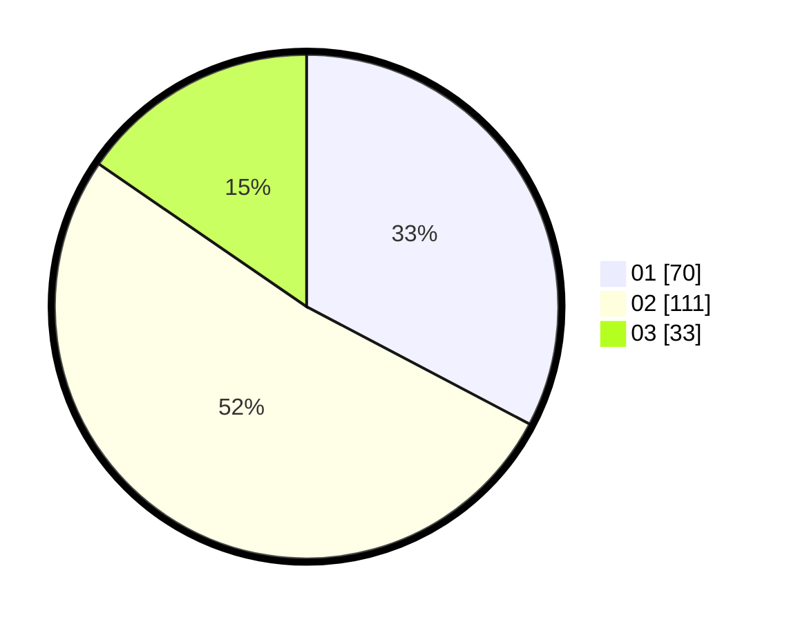

# Hasil

Hasil perolehan suara paslon dapat dilihat pada file paslon-01.txt, paslon-02.txt, dan paslon-03.txt.

Jika tidak ada, artinya data tersebut belum ada pada SIREKAP.

## Perolehan Suara

 * Paslon 01: **70**.
 * Paslon 02: **111**.
 * Paslon 03: **33**.

## Foto C Plano

https://sirekap-obj-formc.kpu.go.id/4ee7/pemilu/ppwp/31/73/07/10/01/3173071001022-20240214-230103--7c667cef-22b7-455b-9b3e-c5c9f7a544f6.jpg

https://sirekap-obj-formc.kpu.go.id/4ee7/pemilu/ppwp/31/73/07/10/01/3173071001022-20240214-230158--30d1f944-08f8-4101-b4b1-5ea89995a11d.jpg

https://sirekap-obj-formc.kpu.go.id/4ee7/pemilu/ppwp/31/73/07/10/01/3173071001022-20240214-230235--02d76244-8a65-49aa-82f8-0d1640dcd6fb.jpg
