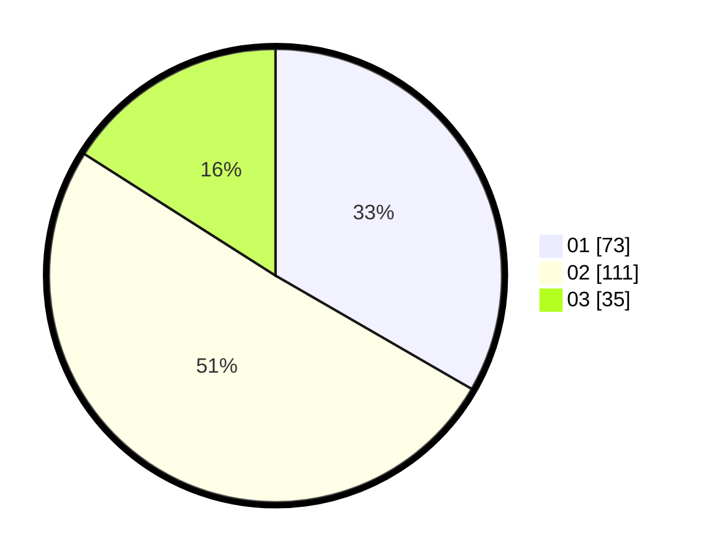

# Hasil

Hasil perolehan suara paslon dapat dilihat pada file paslon-01.txt, paslon-02.txt, dan paslon-03.txt.

Jika tidak ada, artinya data tersebut belum ada pada SIREKAP.

## Perolehan Suara

 * Paslon 01: **73**.
 * Paslon 02: **111**.
 * Paslon 03: **35**.

## Foto C Plano

https://sirekap-obj-formc.kpu.go.id/9c41/pemilu/ppwp/31/73/07/10/01/3173071001029-20240215-000453--795b82bd-9551-4256-b03f-e10ad063448d.jpg

https://sirekap-obj-formc.kpu.go.id/9c41/pemilu/ppwp/31/73/07/10/01/3173071001029-20240215-000652--7b914320-17e4-490c-8f6d-176c83ed7b17.jpg

https://sirekap-obj-formc.kpu.go.id/9c41/pemilu/ppwp/31/73/07/10/01/3173071001029-20240215-000730--36c3859b-d0c0-492a-8ea7-b6c11106aa1c.jpg
