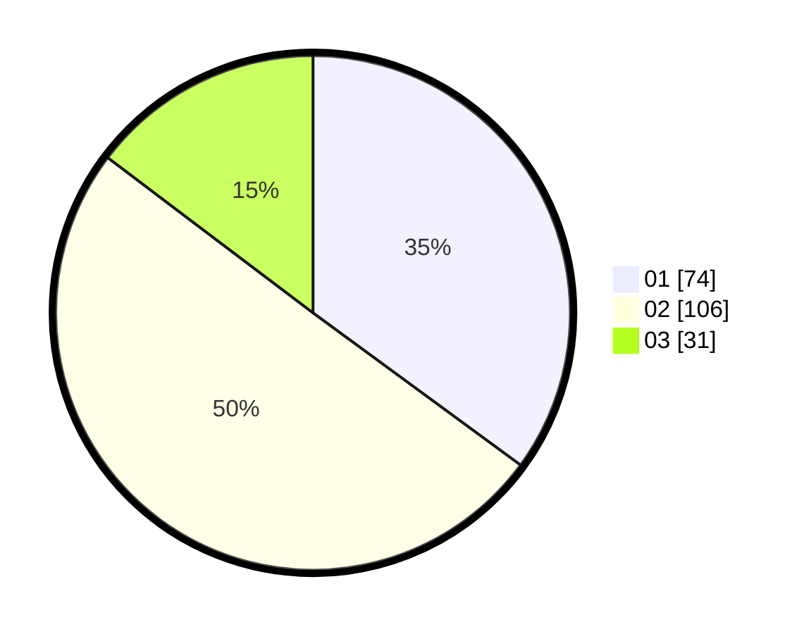

# Hasil

Hasil perolehan suara paslon dapat dilihat pada file paslon-01.txt, paslon-02.txt, dan paslon-03.txt.

Jika tidak ada, artinya data tersebut belum ada pada SIREKAP.

## Perolehan Suara

 * Paslon 01: **74**.
 * Paslon 02: **106**.
 * Paslon 03: **31**.

## Foto C Plano

https://sirekap-obj-formc.kpu.go.id/fe1e/pemilu/ppwp/31/73/07/10/01/3173071001031-20240214-210755--85710f92-1eff-4670-88a6-559198e04dcc.jpg

https://sirekap-obj-formc.kpu.go.id/fe1e/pemilu/ppwp/31/73/07/10/01/3173071001031-20240214-215642--c3a8c3da-5ad7-4bd5-9d54-3db5f6d28b7a.jpg

https://sirekap-obj-formc.kpu.go.id/fe1e/pemilu/ppwp/31/73/07/10/01/3173071001031-20240214-210515--858372b4-30cb-474f-8cd0-d2eb7b602d26.jpg

## DATA PEMILIH TETAP

Jumlah pemilih dalam DPT: **270**.
 * L: **146**.
 * P: **628**.

## DATA PENGGUNA HAK PILIH

Jumlah pengguna hak pilih dalam DPT: **262**.
 * L: **612**.
 * P: **604**.

Jumlah pengguna hak pilih dalam DPTb: **5**.
 * L: **6**.
 * P: **0**.

Jumlah pengguna hak pilih dalam DPK: **0**.
 * L: **0**.
 * P: **0**.

Jumlah pengguna hak pilih: **262**.
 * L: **167**.
 * P: **605**.

## JUMLAH SUARA SAH DAN TIDAK SAH

JUMLAH SELURUH SUARA SAH: **211**.

JUMLAH SUARA TIDAK SAH: **2**.

JUMLAH SELURUH SUARA SAH DAN SUARA TIDAK SAH: **213**.
