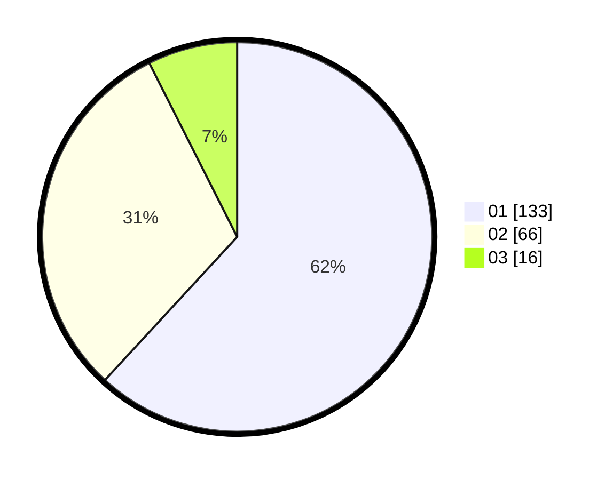

# Hasil

Hasil perolehan suara paslon dapat dilihat pada file paslon-01.txt, paslon-02.txt, dan paslon-03.txt.

Jika tidak ada, artinya data tersebut belum ada pada SIREKAP.

## Perolehan Suara

 * Paslon 01: **133**.
 * Paslon 02: **66**.
 * Paslon 03: **16**.

## Foto C Plano

https://sirekap-obj-formc.kpu.go.id/c0f0/pemilu/ppwp/31/73/07/10/01/3173071001039-20240215-002331--fd052e15-86ae-4940-b02f-1b2e306ff67c.jpg

https://sirekap-obj-formc.kpu.go.id/c0f0/pemilu/ppwp/31/73/07/10/01/3173071001039-20240214-205047--14c773c6-6c7a-463e-bfcc-369dcd826855.jpg

https://sirekap-obj-formc.kpu.go.id/c0f0/pemilu/ppwp/31/73/07/10/01/3173071001039-20240214-205038--874717f5-029f-467e-aa92-5b4d5335f313.jpg
