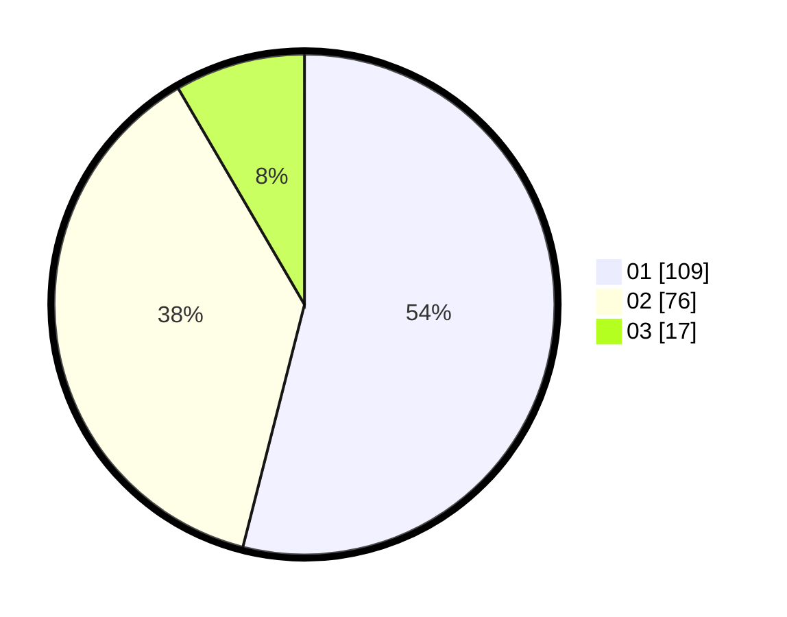

# Hasil

Hasil perolehan suara paslon dapat dilihat pada file paslon-01.txt, paslon-02.txt, dan paslon-03.txt.

Jika tidak ada, artinya data tersebut belum ada pada SIREKAP.

## Perolehan Suara

 * Paslon 01: **109**.
 * Paslon 02: **76**.
 * Paslon 03: **17**.

## Foto C Plano

https://sirekap-obj-formc.kpu.go.id/001d/pemilu/ppwp/31/73/07/10/01/3173071001043-20240214-232232--aec82d93-a2c6-4578-998c-e8ec496c39ac.jpg

https://sirekap-obj-formc.kpu.go.id/001d/pemilu/ppwp/31/73/07/10/01/3173071001043-20240215-014345--8f897683-163a-4e6c-8670-6b0abfda201b.jpg

https://sirekap-obj-formc.kpu.go.id/001d/pemilu/ppwp/31/73/07/10/01/3173071001043-20240215-014606--ff1ffd31-d7c3-4f49-996f-b20a6ac7b6a6.jpg
