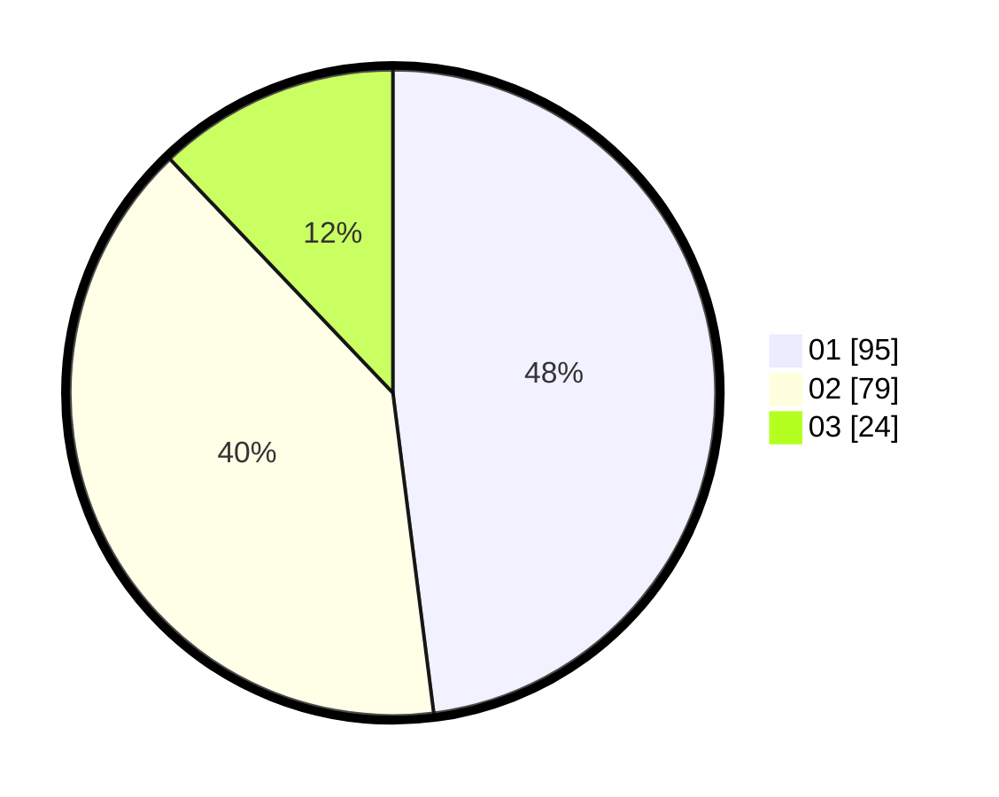

# Hasil

Hasil perolehan suara paslon dapat dilihat pada file paslon-01.txt, paslon-02.txt, dan paslon-03.txt.

Jika tidak ada, artinya data tersebut belum ada pada SIREKAP.

## Perolehan Suara

 * Paslon 01: **95**.
 * Paslon 02: **79**.
 * Paslon 03: **24**.

## Foto C Plano

https://sirekap-obj-formc.kpu.go.id/58ed/pemilu/ppwp/31/73/07/10/01/3173071001044-20240214-222639--26999504-94fc-4c50-b7eb-40769b8e1557.jpg

https://sirekap-obj-formc.kpu.go.id/58ed/pemilu/ppwp/31/73/07/10/01/3173071001044-20240214-222435--af030c90-5b94-4fa2-8374-c64a77875a6e.jpg

https://sirekap-obj-formc.kpu.go.id/58ed/pemilu/ppwp/31/73/07/10/01/3173071001044-20240214-222920--fe8f1ed3-cd0f-4808-8bde-ac412fc1c555.jpg
