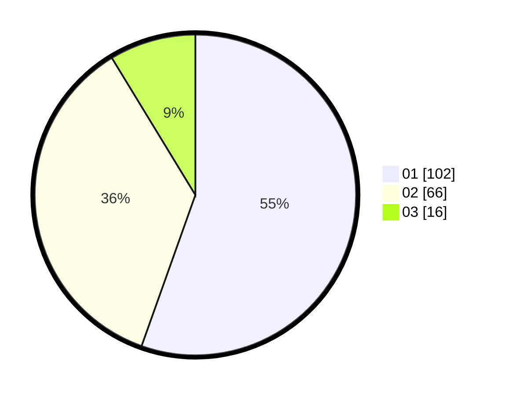

# Hasil

Hasil perolehan suara paslon dapat dilihat pada file paslon-01.txt, paslon-02.txt, dan paslon-03.txt.

Jika tidak ada, artinya data tersebut belum ada pada SIREKAP.

## Perolehan Suara

 * Paslon 01: **102**.
 * Paslon 02: **66**.
 * Paslon 03: **16**.

## Foto C Plano

https://sirekap-obj-formc.kpu.go.id/c13e/pemilu/ppwp/31/73/07/10/01/3173071001047-20240214-221137--ae6d10ab-5ab5-4d98-b7c8-36a984ea4976.jpg

https://sirekap-obj-formc.kpu.go.id/c13e/pemilu/ppwp/31/73/07/10/01/3173071001047-20240214-221152--a83ed321-d9c9-4069-973a-5a54c2afcab7.jpg

https://sirekap-obj-formc.kpu.go.id/c13e/pemilu/ppwp/31/73/07/10/01/3173071001047-20240214-221156--6a399dcb-9c74-4da8-ab5e-d03ea55e0812.jpg
