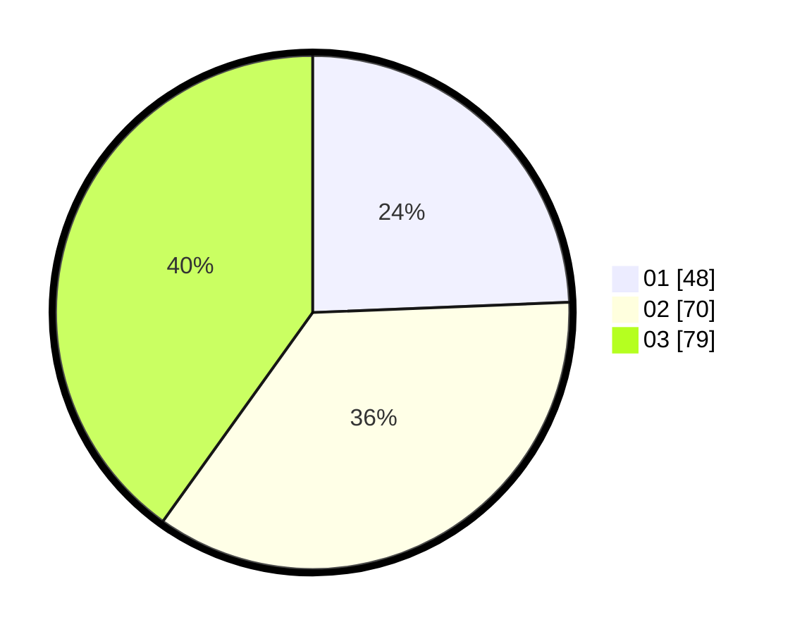

# Hasil

Hasil perolehan suara paslon dapat dilihat pada file paslon-01.txt, paslon-02.txt, dan paslon-03.txt.

Jika tidak ada, artinya data tersebut belum ada pada SIREKAP.

## Perolehan Suara

 * Paslon 01: **48**.
 * Paslon 02: **70**.
 * Paslon 03: **79**.

## Foto C Plano

https://sirekap-obj-formc.kpu.go.id/d0db/pemilu/ppwp/31/73/07/10/01/3173071001048-20240214-232206--52baeca2-a6d8-432b-8ce0-b47457a497c9.jpg

https://sirekap-obj-formc.kpu.go.id/d0db/pemilu/ppwp/31/73/07/10/01/3173071001048-20240214-232229--1e294896-a55f-4c1b-b0b7-f619a2dd31d0.jpg
