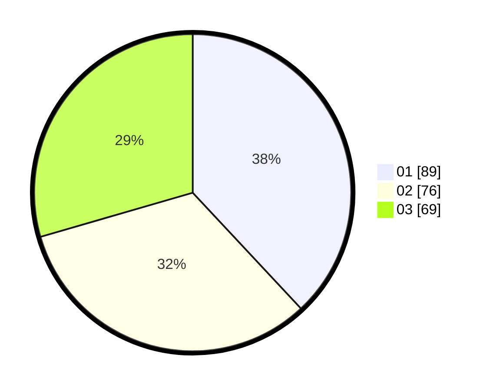

# Hasil

Hasil perolehan suara paslon dapat dilihat pada file paslon-01.txt, paslon-02.txt, dan paslon-03.txt.

Jika tidak ada, artinya data tersebut belum ada pada SIREKAP.

## Perolehan Suara

 * Paslon 01: **89**.
 * Paslon 02: **76**.
 * Paslon 03: **69**.

## Foto C Plano

https://sirekap-obj-formc.kpu.go.id/8bd5/pemilu/ppwp/31/73/07/10/01/3173071001049-20240214-220929--31c0fdf7-adfa-40e1-a4aa-b4f35f980c04.jpg

https://sirekap-obj-formc.kpu.go.id/8bd5/pemilu/ppwp/31/73/07/10/01/3173071001049-20240214-220939--11957c92-f1e3-4b34-840a-72a3fdf0394b.jpg

https://sirekap-obj-formc.kpu.go.id/8bd5/pemilu/ppwp/31/73/07/10/01/3173071001049-20240214-220949--3c278290-4f4d-4e09-b381-dc76274f51b5.jpg
