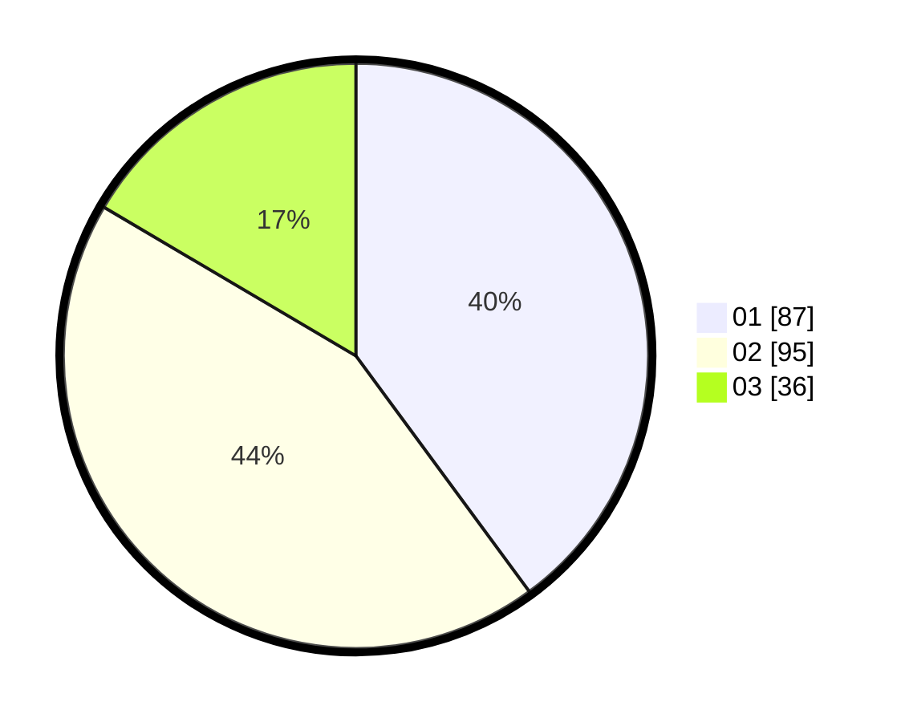

# Hasil

Hasil perolehan suara paslon dapat dilihat pada file paslon-01.txt, paslon-02.txt, dan paslon-03.txt.

Jika tidak ada, artinya data tersebut belum ada pada SIREKAP.

## Perolehan Suara

 * Paslon 01: **87**.
 * Paslon 02: **95**.
 * Paslon 03: **36**.

## Foto C Plano

https://sirekap-obj-formc.kpu.go.id/a441/pemilu/ppwp/31/73/07/10/01/3173071001058-20240214-223729--40affc9c-bab0-446b-b0c9-26bfcba0afe1.jpg

https://sirekap-obj-formc.kpu.go.id/a441/pemilu/ppwp/31/73/07/10/01/3173071001058-20240214-223821--72626ef5-a751-432d-b1fe-2ec6275b7573.jpg

https://sirekap-obj-formc.kpu.go.id/a441/pemilu/ppwp/31/73/07/10/01/3173071001058-20240214-223933--1df8269a-cc41-4e0d-8904-50ed0f0427c5.jpg
