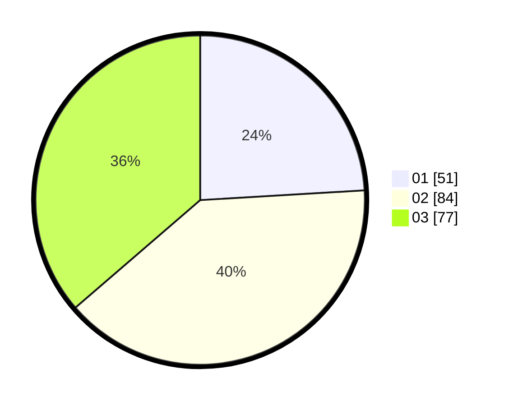

# Hasil

Hasil perolehan suara paslon dapat dilihat pada file paslon-01.txt, paslon-02.txt, dan paslon-03.txt.

Jika tidak ada, artinya data tersebut belum ada pada SIREKAP.

## Perolehan Suara

 * Paslon 01: **51**.
 * Paslon 02: **84**.
 * Paslon 03: **77**.

## Foto C Plano

https://sirekap-obj-formc.kpu.go.id/e275/pemilu/ppwp/31/73/07/10/01/3173071001062-20240214-155339--81fe6749-fb96-488d-9d6c-316bd66dc94e.jpg

https://sirekap-obj-formc.kpu.go.id/e275/pemilu/ppwp/31/73/07/10/01/3173071001062-20240214-155930--9c753ffc-36b3-4834-9e9f-f593bba8426b.jpg
