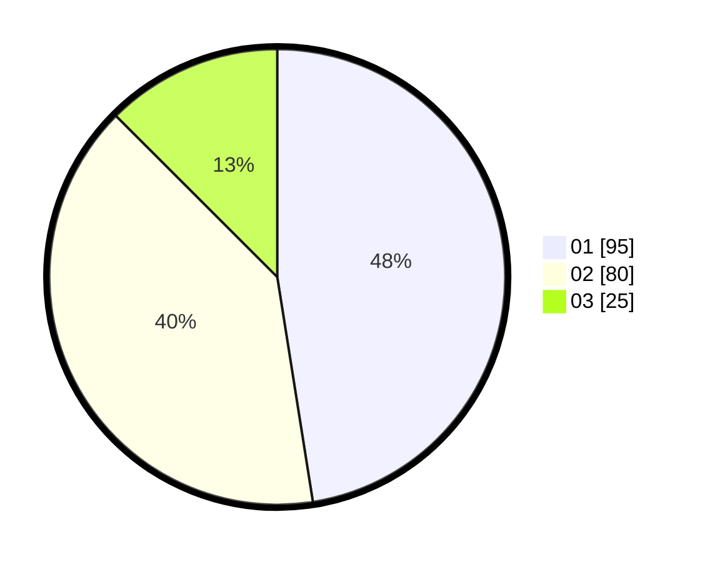

# Hasil

Hasil perolehan suara paslon dapat dilihat pada file paslon-01.txt, paslon-02.txt, dan paslon-03.txt.

Jika tidak ada, artinya data tersebut belum ada pada SIREKAP.

## Perolehan Suara

 * Paslon 01: **95**.
 * Paslon 02: **80**.
 * Paslon 03: **25**.

## Foto C Plano

https://sirekap-obj-formc.kpu.go.id/d5be/pemilu/ppwp/31/73/07/10/01/3173071001063-20240214-220840--5e9bef0a-d9d6-4c76-8fad-f9a0bc0fe0c0.jpg

https://sirekap-obj-formc.kpu.go.id/d5be/pemilu/ppwp/31/73/07/10/01/3173071001063-20240215-002520--7a783d6e-f5a1-4330-8013-9e62d92e2699.jpg

https://sirekap-obj-formc.kpu.go.id/d5be/pemilu/ppwp/31/73/07/10/01/3173071001063-20240214-221205--5f7bc17d-1352-48a2-88da-0559546ec718.jpg

## DATA PEMILIH TETAP

Jumlah pemilih dalam DPT: **276**.
 * L: **148**.
 * P: **128**.

## DATA PENGGUNA HAK PILIH

Jumlah pengguna hak pilih dalam DPT: **200**.
 * L: **103**.
 * P: **97**.

Jumlah pengguna hak pilih dalam DPTb: **0**.
 * L: **0**.
 * P: **0**.

Jumlah pengguna hak pilih dalam DPK: **4**.
 * L: **2**.
 * P: **2**.

Jumlah pengguna hak pilih: **204**.
 * L: **105**.
 * P: **99**.

## JUMLAH SUARA SAH DAN TIDAK SAH

JUMLAH SELURUH SUARA SAH: **200**.

JUMLAH SUARA TIDAK SAH: **4**.

JUMLAH SELURUH SUARA SAH DAN SUARA TIDAK SAH: **204**.
