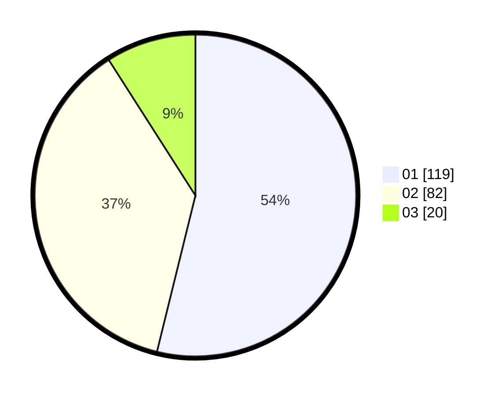

# Hasil

Hasil perolehan suara paslon dapat dilihat pada file paslon-01.txt, paslon-02.txt, dan paslon-03.txt.

Jika tidak ada, artinya data tersebut belum ada pada SIREKAP.

## Perolehan Suara

 * Paslon 01: **119**.
 * Paslon 02: **82**.
 * Paslon 03: **20**.

## Foto C Plano

https://sirekap-obj-formc.kpu.go.id/856f/pemilu/ppwp/31/73/07/10/01/3173071001067-20240214-230244--3924b679-2f71-48d2-82aa-3a2183b75842.jpg

https://sirekap-obj-formc.kpu.go.id/856f/pemilu/ppwp/31/73/07/10/01/3173071001067-20240215-181712--751c7611-200f-4282-b391-bf83a3c3b01c.jpg

https://sirekap-obj-formc.kpu.go.id/856f/pemilu/ppwp/31/73/07/10/01/3173071001067-20240215-181910--c4a08114-284b-4b69-a756-0f16bbb0c497.jpg
