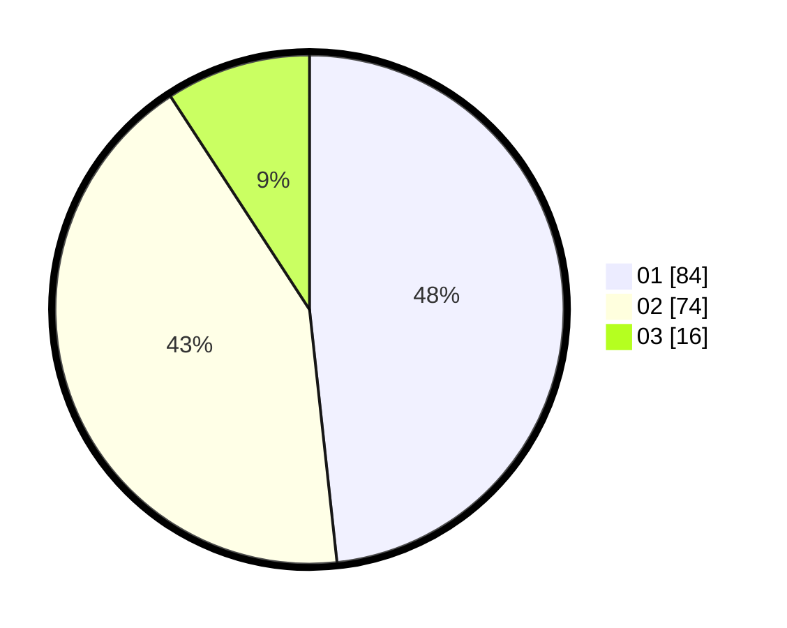

# Hasil

Hasil perolehan suara paslon dapat dilihat pada file paslon-01.txt, paslon-02.txt, dan paslon-03.txt.

Jika tidak ada, artinya data tersebut belum ada pada SIREKAP.

## Perolehan Suara

 * Paslon 01: **84**.
 * Paslon 02: **74**.
 * Paslon 03: **16**.

## Foto C Plano

https://sirekap-obj-formc.kpu.go.id/7675/pemilu/ppwp/31/73/07/10/01/3173071001070-20240214-211316--2dc990e8-14fc-44ee-88fd-00ead0e9a06e.jpg

https://sirekap-obj-formc.kpu.go.id/7675/pemilu/ppwp/31/73/07/10/01/3173071001070-20240214-225011--5a5dfe6c-67d3-4131-970b-10a5072d2a7b.jpg

https://sirekap-obj-formc.kpu.go.id/7675/pemilu/ppwp/31/73/07/10/01/3173071001070-20240214-211629--66781ffc-4697-455e-8425-2c9837486bc1.jpg
