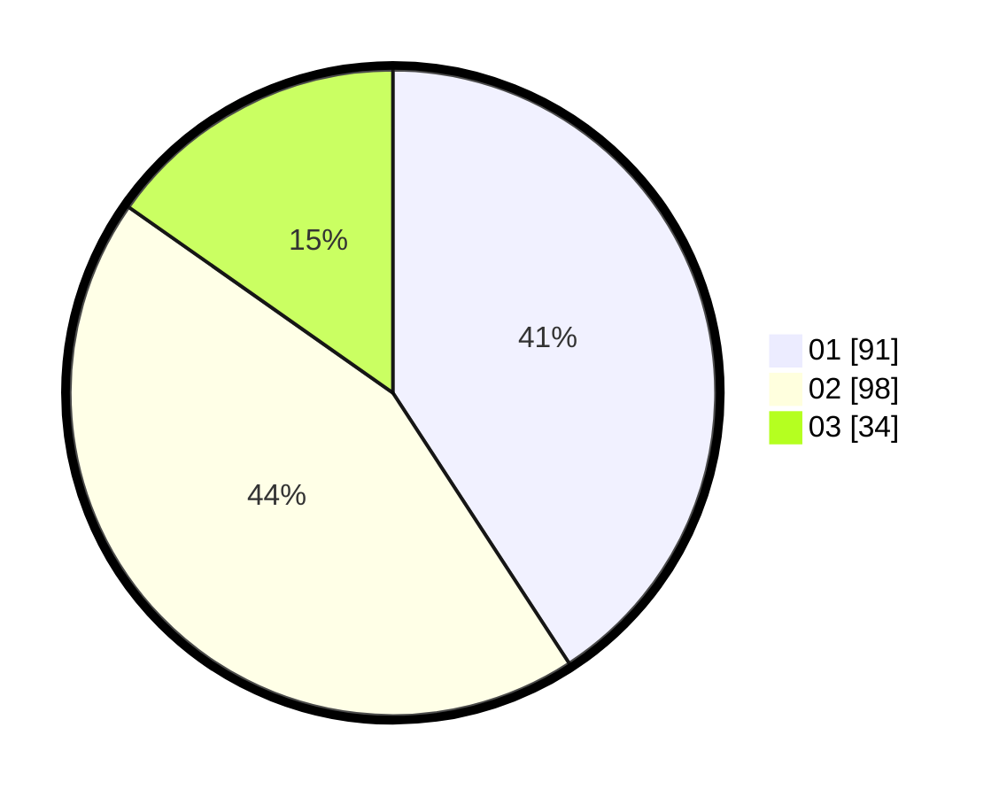

# Hasil

Hasil perolehan suara paslon dapat dilihat pada file paslon-01.txt, paslon-02.txt, dan paslon-03.txt.

Jika tidak ada, artinya data tersebut belum ada pada SIREKAP.

## Perolehan Suara

 * Paslon 01: **91**.
 * Paslon 02: **98**.
 * Paslon 03: **34**.

## Foto C Plano

https://sirekap-obj-formc.kpu.go.id/edaf/pemilu/ppwp/31/73/07/10/01/3173071001072-20240215-004820--d8cdbf55-0a4c-4fea-b258-ea8958d40d4e.jpg

https://sirekap-obj-formc.kpu.go.id/edaf/pemilu/ppwp/31/73/07/10/01/3173071001072-20240215-004933--74a11ee1-9b03-49df-b2ab-61777ec9a359.jpg

https://sirekap-obj-formc.kpu.go.id/edaf/pemilu/ppwp/31/73/07/10/01/3173071001072-20240215-005246--de1d86a5-1c4f-42fe-8f16-7c25ba5de598.jpg
