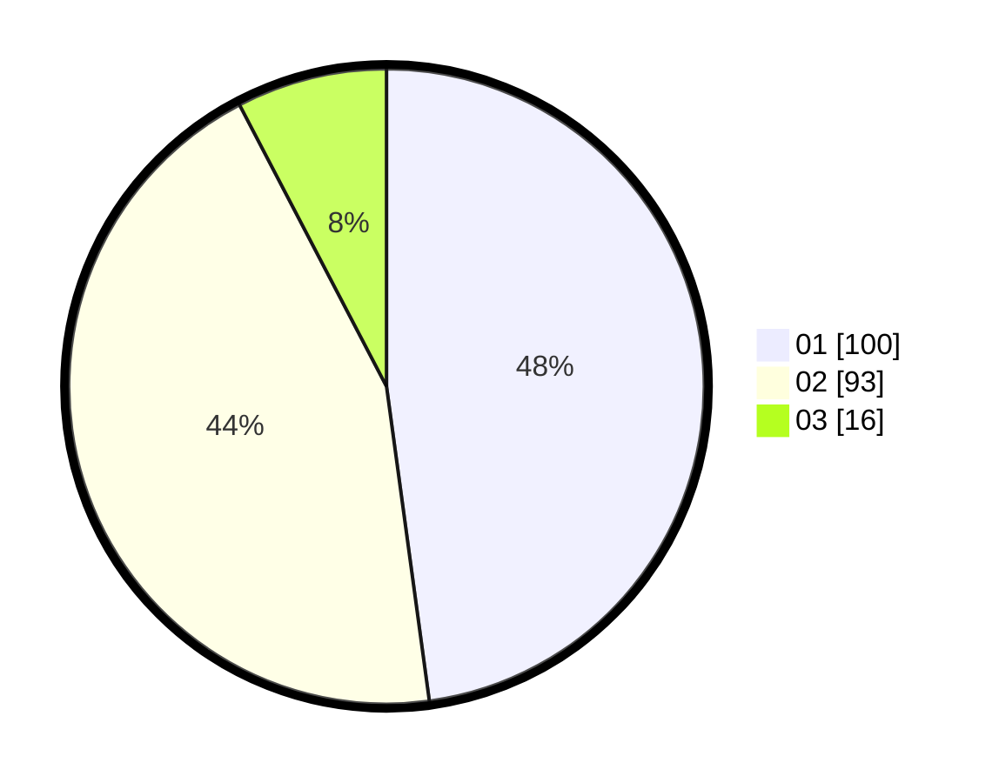

# Hasil

Hasil perolehan suara paslon dapat dilihat pada file paslon-01.txt, paslon-02.txt, dan paslon-03.txt.

Jika tidak ada, artinya data tersebut belum ada pada SIREKAP.

## Perolehan Suara

 * Paslon 01: **100**.
 * Paslon 02: **93**.
 * Paslon 03: **16**.

## Foto C Plano

https://sirekap-obj-formc.kpu.go.id/e93f/pemilu/ppwp/31/73/07/10/01/3173071001073-20240214-155432--5433e67f-bc3c-4a6b-9420-1e9c322dd46d.jpg

https://sirekap-obj-formc.kpu.go.id/e93f/pemilu/ppwp/31/73/07/10/01/3173071001073-20240214-155557--a8245943-6b67-4422-94d9-5f6de0b66ea4.jpg

https://sirekap-obj-formc.kpu.go.id/e93f/pemilu/ppwp/31/73/07/10/01/3173071001073-20240214-155626--8a743848-204a-49c2-b52a-ea654e6fd47a.jpg

## DATA PEMILIH TETAP

Jumlah pemilih dalam DPT: **267**.
 * L: **137**.
 * P: **130**.

## DATA PENGGUNA HAK PILIH

Jumlah pengguna hak pilih dalam DPT: **210**.
 * L: **108**.
 * P: **102**.

Jumlah pengguna hak pilih dalam DPTb: **1**.
 * L: **0**.
 * P: **1**.

Jumlah pengguna hak pilih dalam DPK: **1**.
 * L: **0**.
 * P: **1**.

Jumlah pengguna hak pilih: **212**.
 * L: **108**.
 * P: **104**.

## JUMLAH SUARA SAH DAN TIDAK SAH

JUMLAH SELURUH SUARA SAH: **209**.

JUMLAH SUARA TIDAK SAH: **3**.

JUMLAH SELURUH SUARA SAH DAN SUARA TIDAK SAH: **212**.
