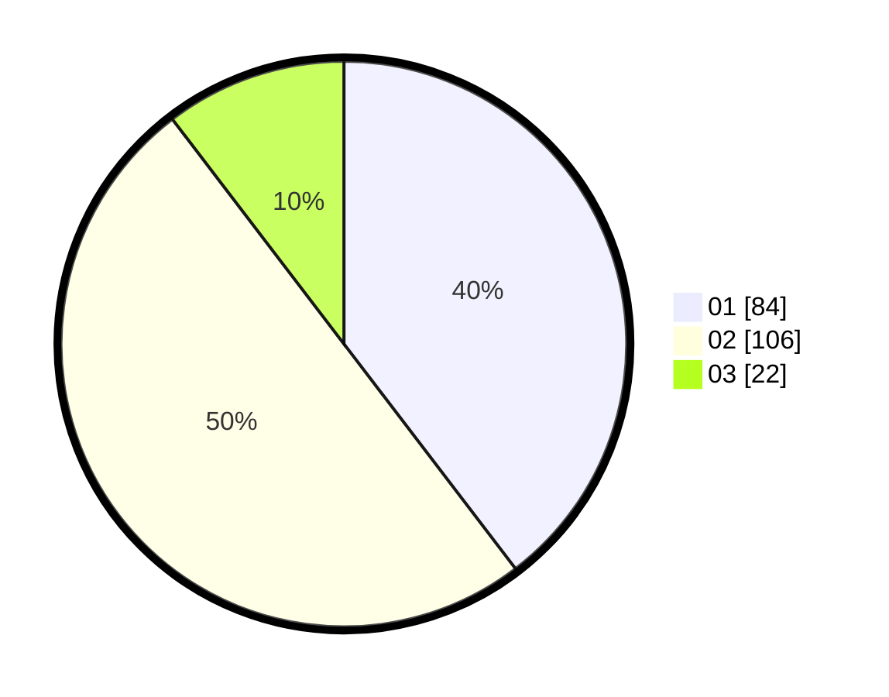

# Hasil

Hasil perolehan suara paslon dapat dilihat pada file paslon-01.txt, paslon-02.txt, dan paslon-03.txt.

Jika tidak ada, artinya data tersebut belum ada pada SIREKAP.

## Perolehan Suara

 * Paslon 01: **84**.
 * Paslon 02: **106**.
 * Paslon 03: **22**.

## Foto C Plano

https://sirekap-obj-formc.kpu.go.id/2bec/pemilu/ppwp/31/73/07/10/01/3173071001074-20240214-221119--2ac1160a-902f-4ad5-a5ee-90e5f51533ab.jpg

https://sirekap-obj-formc.kpu.go.id/2bec/pemilu/ppwp/31/73/07/10/01/3173071001074-20240214-230123--269cc2d3-63ab-43f1-aa8b-50cac9be7dfe.jpg

https://sirekap-obj-formc.kpu.go.id/2bec/pemilu/ppwp/31/73/07/10/01/3173071001074-20240214-221524--f1b5d2b2-c3e5-485f-8b6b-fbf6bfe50b5c.jpg
