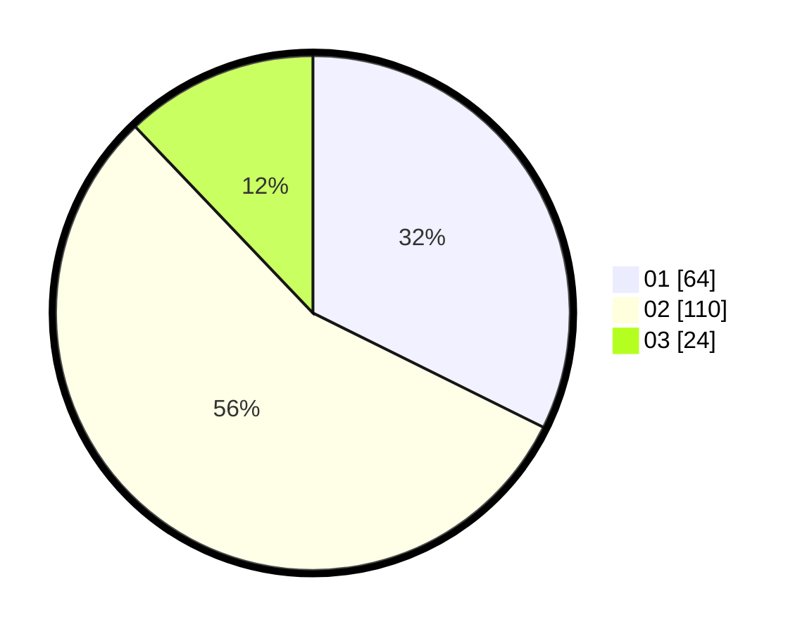

# Hasil

Hasil perolehan suara paslon dapat dilihat pada file paslon-01.txt, paslon-02.txt, dan paslon-03.txt.

Jika tidak ada, artinya data tersebut belum ada pada SIREKAP.

## Perolehan Suara

 * Paslon 01: **64**.
 * Paslon 02: **110**.
 * Paslon 03: **24**.

## Foto C Plano

https://sirekap-obj-formc.kpu.go.id/1c82/pemilu/ppwp/31/73/07/10/01/3173071001077-20240215-062353--aaf68da6-22b3-4bcf-b3ed-bd0dd3cb476a.jpg

https://sirekap-obj-formc.kpu.go.id/1c82/pemilu/ppwp/31/73/07/10/01/3173071001077-20240215-062357--2db7b280-b96e-4b02-bdf1-9544d288c5d9.jpg

https://sirekap-obj-formc.kpu.go.id/1c82/pemilu/ppwp/31/73/07/10/01/3173071001077-20240215-062402--639726f2-dc67-40ae-b656-6a6d48c1c8f2.jpg
