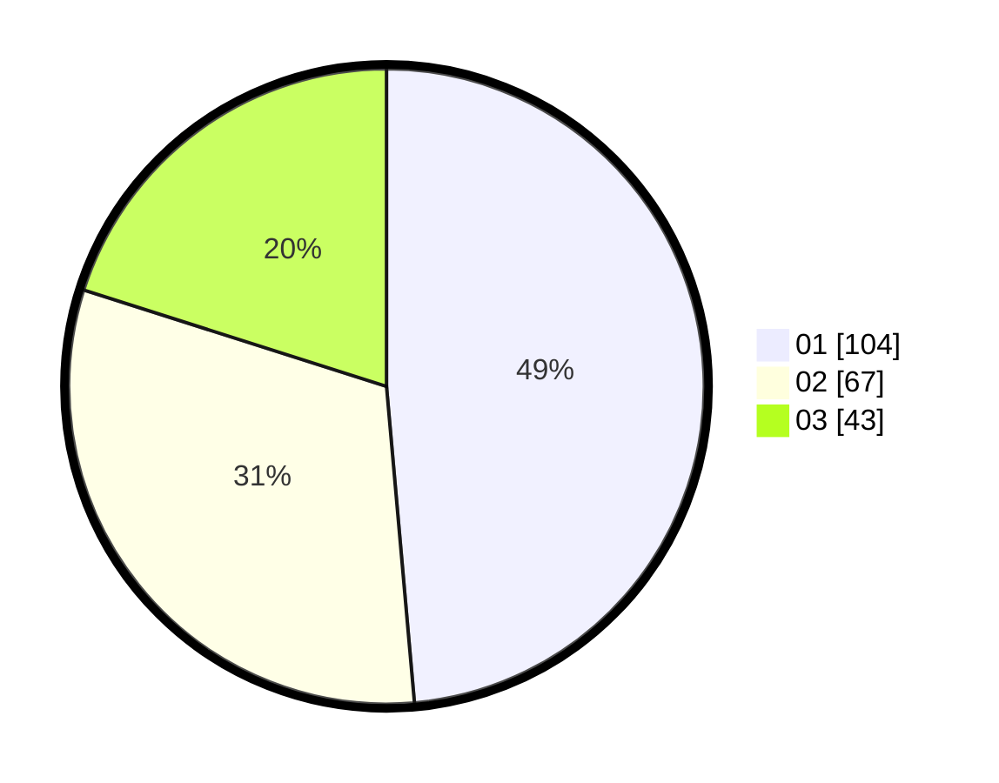

# Hasil

Hasil perolehan suara paslon dapat dilihat pada file paslon-01.txt, paslon-02.txt, dan paslon-03.txt.

Jika tidak ada, artinya data tersebut belum ada pada SIREKAP.

## Perolehan Suara

 * Paslon 01: **104**.
 * Paslon 02: **67**.
 * Paslon 03: **43**.

## Foto C Plano

https://sirekap-obj-formc.kpu.go.id/b233/pemilu/ppwp/31/73/07/10/01/3173071001078-20240214-201414--2c6a9ee0-33b3-4f37-868b-a1a860e702a1.jpg

https://sirekap-obj-formc.kpu.go.id/b233/pemilu/ppwp/31/73/07/10/01/3173071001078-20240214-201700--006dc513-9593-48ab-924f-957c2d72ecef.jpg

https://sirekap-obj-formc.kpu.go.id/b233/pemilu/ppwp/31/73/07/10/01/3173071001078-20240214-201828--19fecac2-91f4-4af0-9126-b3c8ee131058.jpg

## DATA PEMILIH TETAP

Jumlah pemilih dalam DPT: **267**.
 * L: **139**.
 * P: **128**.

## DATA PENGGUNA HAK PILIH

Jumlah pengguna hak pilih dalam DPT: **209**.
 * L: **106**.
 * P: **103**.

Jumlah pengguna hak pilih dalam DPTb: **2**.
 * L: **1**.
 * P: **1**.

Jumlah pengguna hak pilih dalam DPK: **3**.
 * L: **1**.
 * P: **2**.

Jumlah pengguna hak pilih: **214**.
 * L: **108**.
 * P: **106**.

## JUMLAH SUARA SAH DAN TIDAK SAH

JUMLAH SELURUH SUARA SAH: **214**.

JUMLAH SUARA TIDAK SAH: **2**.

JUMLAH SELURUH SUARA SAH DAN SUARA TIDAK SAH: **216**.
