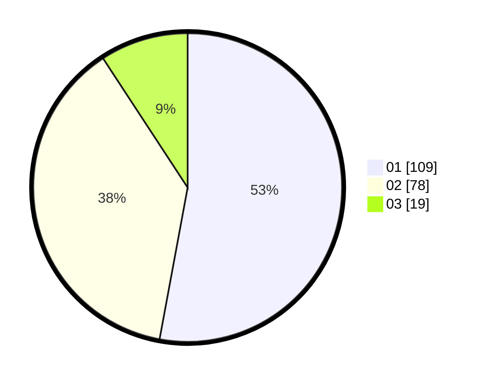

# Hasil

Hasil perolehan suara paslon dapat dilihat pada file paslon-01.txt, paslon-02.txt, dan paslon-03.txt.

Jika tidak ada, artinya data tersebut belum ada pada SIREKAP.

## Perolehan Suara

 * Paslon 01: **109**.
 * Paslon 02: **78**.
 * Paslon 03: **19**.

## Foto C Plano

https://sirekap-obj-formc.kpu.go.id/5593/pemilu/ppwp/31/73/07/10/01/3173071001081-20240214-213229--39afcea4-fea6-4dec-b174-9f7f9037ba69.jpg

https://sirekap-obj-formc.kpu.go.id/5593/pemilu/ppwp/31/73/07/10/01/3173071001081-20240214-213236--6f19f9b2-488d-423c-806a-df78ee4de13e.jpg

https://sirekap-obj-formc.kpu.go.id/5593/pemilu/ppwp/31/73/07/10/01/3173071001081-20240214-213242--85e70af1-6483-487f-b73e-8009a8f3ff41.jpg
