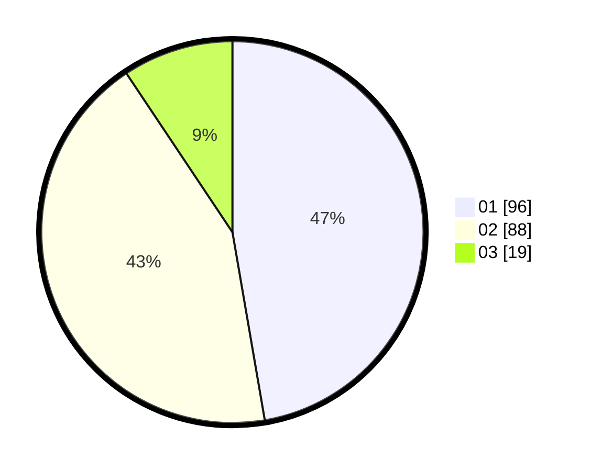

# Hasil

Hasil perolehan suara paslon dapat dilihat pada file paslon-01.txt, paslon-02.txt, dan paslon-03.txt.

Jika tidak ada, artinya data tersebut belum ada pada SIREKAP.

## Perolehan Suara

 * Paslon 01: **96**.
 * Paslon 02: **88**.
 * Paslon 03: **19**.

## Foto C Plano

https://sirekap-obj-formc.kpu.go.id/2e23/pemilu/ppwp/31/73/07/10/01/3173071001083-20240215-003254--36bced15-8422-4ed8-b765-ea9b632a9551.jpg

https://sirekap-obj-formc.kpu.go.id/2e23/pemilu/ppwp/31/73/07/10/01/3173071001083-20240214-224303--59149f4a-7a61-4873-b007-eca102cc1867.jpg

https://sirekap-obj-formc.kpu.go.id/2e23/pemilu/ppwp/31/73/07/10/01/3173071001083-20240214-224357--2529ef36-9262-4488-a6da-375db3791647.jpg
