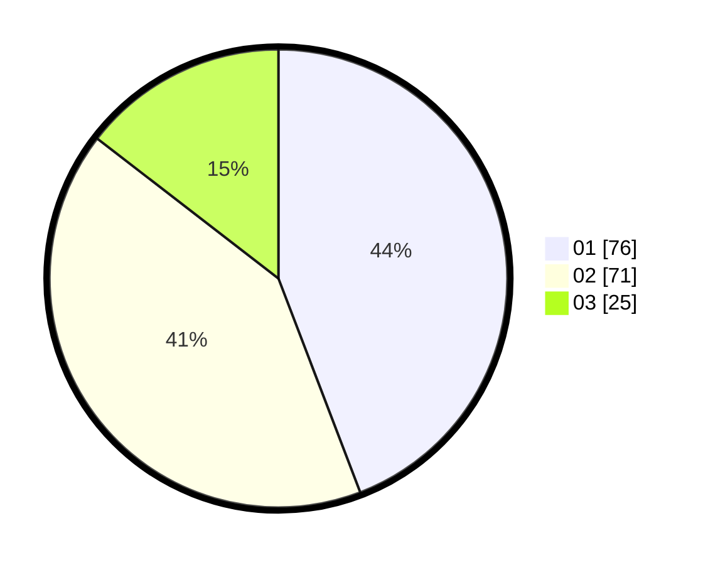

# Hasil

Hasil perolehan suara paslon dapat dilihat pada file paslon-01.txt, paslon-02.txt, dan paslon-03.txt.

Jika tidak ada, artinya data tersebut belum ada pada SIREKAP.

## Perolehan Suara

 * Paslon 01: **76**.
 * Paslon 02: **71**.
 * Paslon 03: **25**.

## Foto C Plano

https://sirekap-obj-formc.kpu.go.id/0e56/pemilu/ppwp/31/73/07/10/01/3173071001084-20240214-214734--ea9cd5cf-8bec-4417-8384-e69098b5a2ae.jpg

https://sirekap-obj-formc.kpu.go.id/0e56/pemilu/ppwp/31/73/07/10/01/3173071001084-20240214-214927--72038fc5-ce2e-4524-beb4-cdbcb02f30af.jpg

https://sirekap-obj-formc.kpu.go.id/0e56/pemilu/ppwp/31/73/07/10/01/3173071001084-20240214-215019--58a32a0e-b031-4e4b-82c8-be7b04e79dae.jpg
