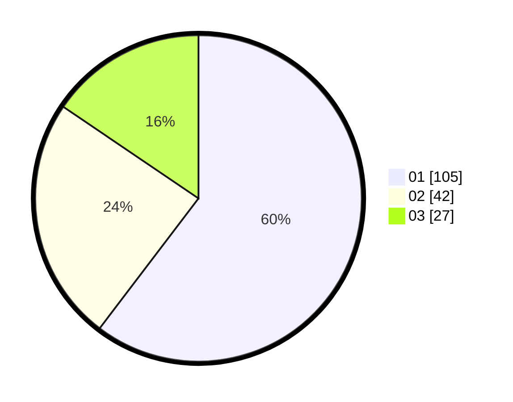

# Hasil

Hasil perolehan suara paslon dapat dilihat pada file paslon-01.txt, paslon-02.txt, dan paslon-03.txt.

Jika tidak ada, artinya data tersebut belum ada pada SIREKAP.

## Perolehan Suara

 * Paslon 01: **105**.
 * Paslon 02: **42**.
 * Paslon 03: **27**.

## Foto C Plano

https://sirekap-obj-formc.kpu.go.id/c3ec/pemilu/ppwp/31/73/07/10/01/3173071001089-20240215-000059--60649ca6-3ec5-47dc-b9a8-571a48a8dbfc.jpg

https://sirekap-obj-formc.kpu.go.id/c3ec/pemilu/ppwp/31/73/07/10/01/3173071001089-20240215-000321--607840f9-da7a-42c4-8cdc-5abb62ae100b.jpg

https://sirekap-obj-formc.kpu.go.id/c3ec/pemilu/ppwp/31/73/07/10/01/3173071001089-20240215-000415--d5ca7543-5e63-4ee4-819d-08a2951be247.jpg
