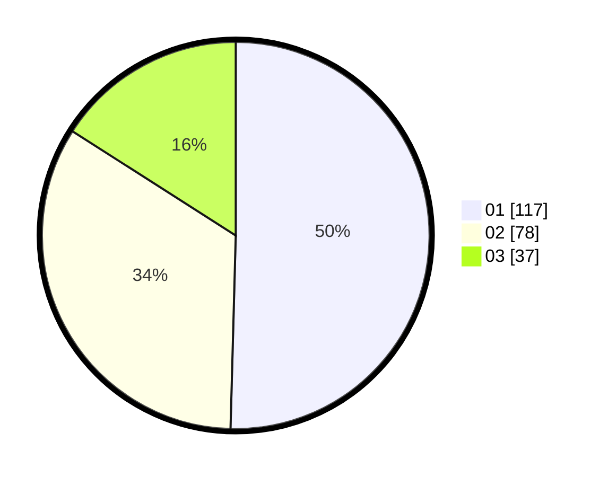

# Hasil

Hasil perolehan suara paslon dapat dilihat pada file paslon-01.txt, paslon-02.txt, dan paslon-03.txt.

Jika tidak ada, artinya data tersebut belum ada pada SIREKAP.

## Perolehan Suara

 * Paslon 01: **117**.
 * Paslon 02: **78**.
 * Paslon 03: **37**.

## Foto C Plano

https://sirekap-obj-formc.kpu.go.id/01fc/pemilu/ppwp/31/73/07/10/01/3173071001092-20240215-005525--a1f5f1a7-5d90-4238-be51-1f0ba4a47d74.jpg

https://sirekap-obj-formc.kpu.go.id/01fc/pemilu/ppwp/31/73/07/10/01/3173071001092-20240215-005716--00e9771e-4ebb-4be4-adeb-3bdc26dad4a5.jpg

https://sirekap-obj-formc.kpu.go.id/01fc/pemilu/ppwp/31/73/07/10/01/3173071001092-20240215-005831--d4e9ab34-b1bf-4504-b2ee-4f09fa602f67.jpg
