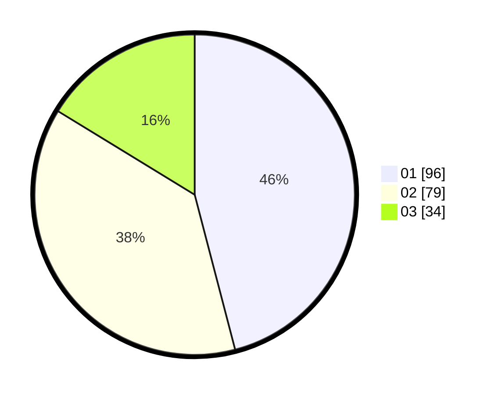

# Hasil

Hasil perolehan suara paslon dapat dilihat pada file paslon-01.txt, paslon-02.txt, dan paslon-03.txt.

Jika tidak ada, artinya data tersebut belum ada pada SIREKAP.

## Perolehan Suara

 * Paslon 01: **96**.
 * Paslon 02: **79**.
 * Paslon 03: **34**.

## Foto C Plano

https://sirekap-obj-formc.kpu.go.id/2762/pemilu/ppwp/31/73/07/10/01/3173071001093-20240216-115448--e6efa549-dd78-4f69-9da4-c70462e796ce.jpg

https://sirekap-obj-formc.kpu.go.id/2762/pemilu/ppwp/31/73/07/10/01/3173071001093-20240216-115451--f2baf68b-cffb-4394-a4e6-34308d79a892.jpg

https://sirekap-obj-formc.kpu.go.id/2762/pemilu/ppwp/31/73/07/10/01/3173071001093-20240216-115450--1077dd69-3bed-4329-9b54-46f44ea8ad2c.jpg

## DATA PEMILIH TETAP

Jumlah pemilih dalam DPT: **259**.
 * L: **128**.
 * P: **131**.

## DATA PENGGUNA HAK PILIH

Jumlah pengguna hak pilih dalam DPT: **207**.
 * L: **101**.
 * P: **106**.

Jumlah pengguna hak pilih dalam DPTb: **0**.
 * L: **1**.
 * P: **0**.

Jumlah pengguna hak pilih dalam DPK: **2**.
 * L: **1**.
 * P: **1**.

Jumlah pengguna hak pilih: **210**.
 * L: **103**.
 * P: **107**.

## JUMLAH SUARA SAH DAN TIDAK SAH

JUMLAH SELURUH SUARA SAH: **209**.

JUMLAH SUARA TIDAK SAH: **1**.

JUMLAH SELURUH SUARA SAH DAN SUARA TIDAK SAH: **210**.
