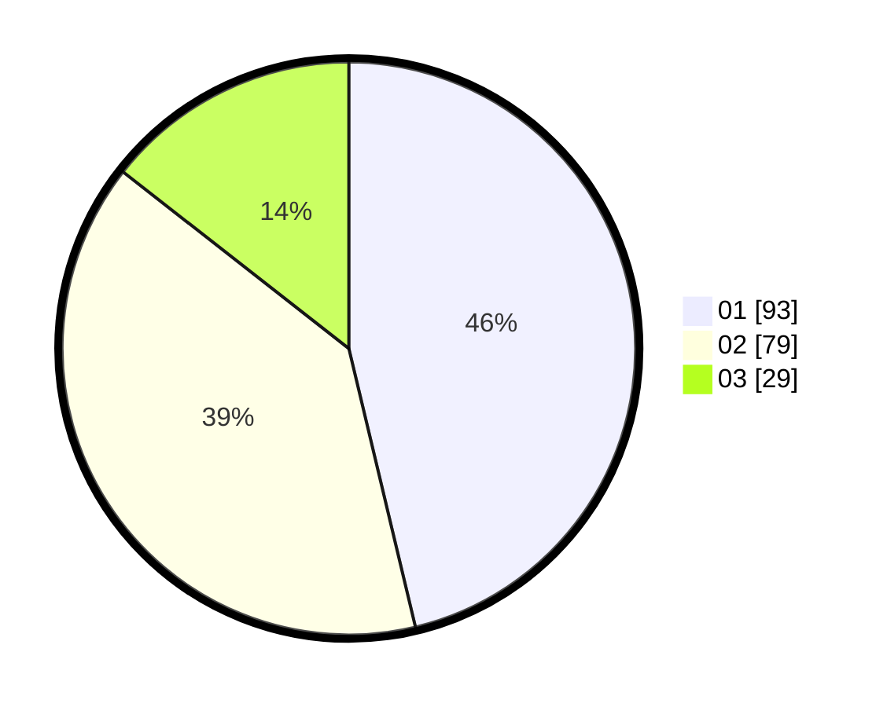

# Hasil

Hasil perolehan suara paslon dapat dilihat pada file paslon-01.txt, paslon-02.txt, dan paslon-03.txt.

Jika tidak ada, artinya data tersebut belum ada pada SIREKAP.

## Perolehan Suara

 * Paslon 01: **93**.
 * Paslon 02: **79**.
 * Paslon 03: **29**.

## Foto C Plano

https://sirekap-obj-formc.kpu.go.id/cca2/pemilu/ppwp/31/73/07/10/01/3173071001094-20240214-213334--23301466-7519-48cb-bc55-c38d254ea58a.jpg

https://sirekap-obj-formc.kpu.go.id/cca2/pemilu/ppwp/31/73/07/10/01/3173071001094-20240214-213439--78c35d77-9b14-431b-8edd-2a14d4eae4c6.jpg

https://sirekap-obj-formc.kpu.go.id/cca2/pemilu/ppwp/31/73/07/10/01/3173071001094-20240214-213552--c524492f-3168-4545-afba-32a8b6fccdda.jpg
