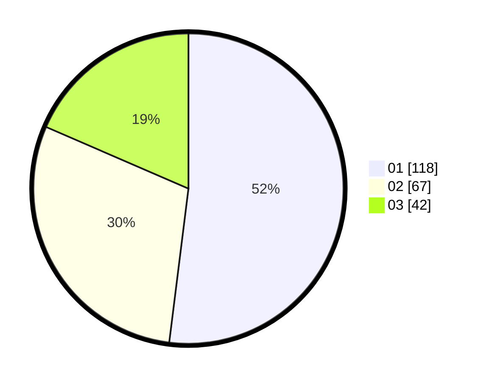

# Hasil

Hasil perolehan suara paslon dapat dilihat pada file paslon-01.txt, paslon-02.txt, dan paslon-03.txt.

Jika tidak ada, artinya data tersebut belum ada pada SIREKAP.

## Perolehan Suara

 * Paslon 01: **118**.
 * Paslon 02: **67**.
 * Paslon 03: **42**.

## Foto C Plano

https://sirekap-obj-formc.kpu.go.id/486c/pemilu/ppwp/31/73/07/10/01/3173071001097-20240215-002855--3b257749-11e9-4d5e-990a-1c3b215f52b0.jpg

https://sirekap-obj-formc.kpu.go.id/486c/pemilu/ppwp/31/73/07/10/01/3173071001097-20240215-003029--55562aa3-d804-42e9-beb4-938fb68fbd58.jpg

https://sirekap-obj-formc.kpu.go.id/486c/pemilu/ppwp/31/73/07/10/01/3173071001097-20240215-003153--574767d3-ff0c-4ab3-9abf-b44e417439e3.jpg

## DATA PEMILIH TETAP

Jumlah pemilih dalam DPT: **257**.
 * L: **114**.
 * P: **143**.

## DATA PENGGUNA HAK PILIH

Jumlah pengguna hak pilih dalam DPT: **218**.
 * L: **91**.
 * P: **127**.

Jumlah pengguna hak pilih dalam DPTb: **5**.
 * L: **2**.
 * P: **3**.

Jumlah pengguna hak pilih dalam DPK: **5**.
 * L: **2**.
 * P: **3**.

Jumlah pengguna hak pilih: **228**.
 * L: **95**.
 * P: **133**.

## JUMLAH SUARA SAH DAN TIDAK SAH

JUMLAH SELURUH SUARA SAH: **227**.

JUMLAH SUARA TIDAK SAH: **1**.

JUMLAH SELURUH SUARA SAH DAN SUARA TIDAK SAH: **228**.
