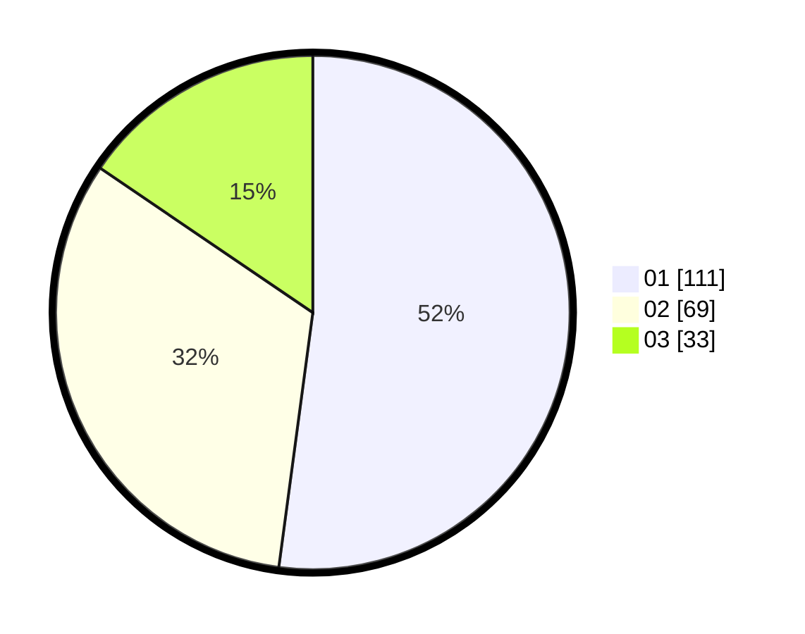

# Hasil

Hasil perolehan suara paslon dapat dilihat pada file paslon-01.txt, paslon-02.txt, dan paslon-03.txt.

Jika tidak ada, artinya data tersebut belum ada pada SIREKAP.

## Perolehan Suara

 * Paslon 01: **111**.
 * Paslon 02: **69**.
 * Paslon 03: **33**.

## Foto C Plano

https://sirekap-obj-formc.kpu.go.id/57b0/pemilu/ppwp/31/73/07/10/01/3173071001099-20240215-002635--39975070-8685-46c7-9a8f-49b672f0f787.jpg

https://sirekap-obj-formc.kpu.go.id/57b0/pemilu/ppwp/31/73/07/10/01/3173071001099-20240215-002812--432ba1f8-15e6-4173-9f17-de3598be0c4e.jpg

https://sirekap-obj-formc.kpu.go.id/57b0/pemilu/ppwp/31/73/07/10/01/3173071001099-20240215-002934--fd14626f-6503-4c39-b08e-dba360a48743.jpg
