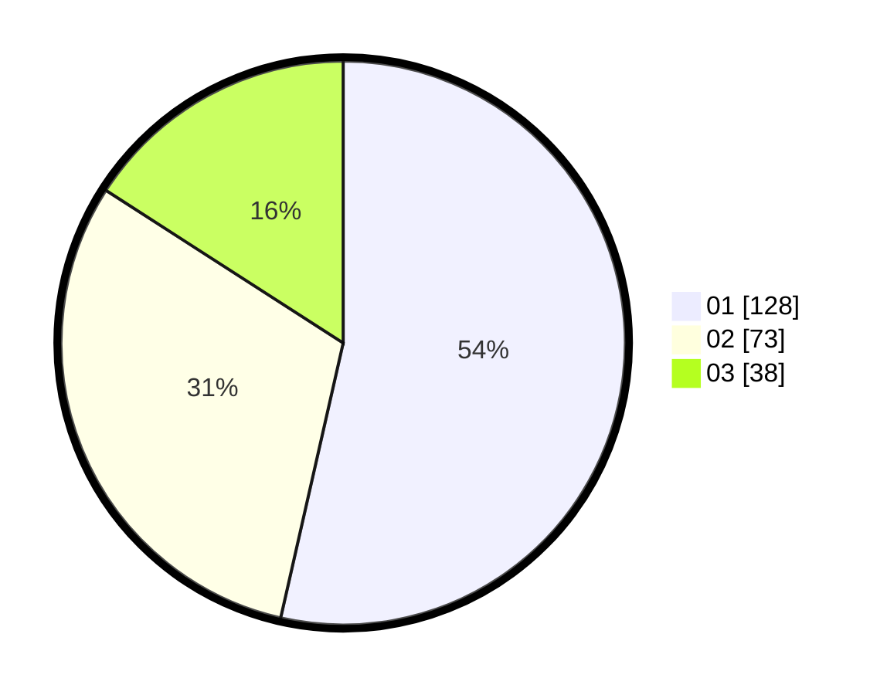

# Hasil

Hasil perolehan suara paslon dapat dilihat pada file paslon-01.txt, paslon-02.txt, dan paslon-03.txt.

Jika tidak ada, artinya data tersebut belum ada pada SIREKAP.

## Perolehan Suara

 * Paslon 01: **128**.
 * Paslon 02: **73**.
 * Paslon 03: **38**.

## Foto C Plano

https://sirekap-obj-formc.kpu.go.id/ae77/pemilu/ppwp/31/73/07/10/01/3173071001100-20240214-215855--b691f550-cf5c-46c6-9a6e-88d3a0d2d29d.jpg

https://sirekap-obj-formc.kpu.go.id/ae77/pemilu/ppwp/31/73/07/10/01/3173071001100-20240214-222300--aa5089eb-0d4e-4b36-93bb-ab79dc40ef07.jpg

https://sirekap-obj-formc.kpu.go.id/ae77/pemilu/ppwp/31/73/07/10/01/3173071001100-20240214-222337--b0c4741d-a2dc-425d-97fa-6741dc7b08d6.jpg
